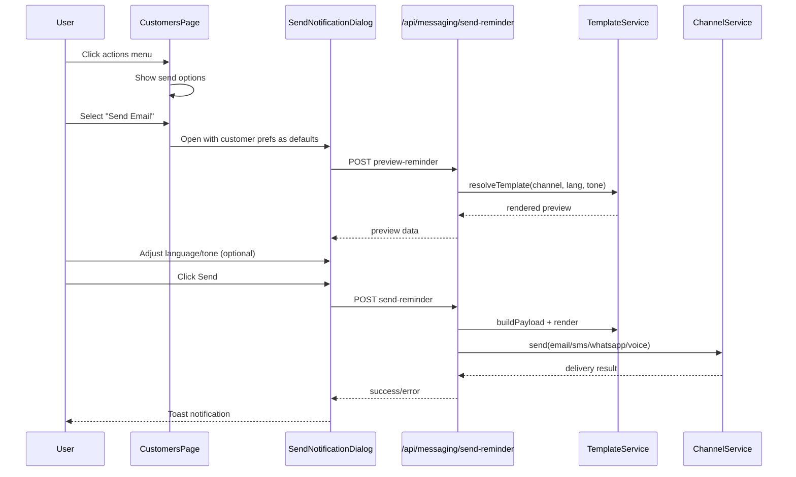
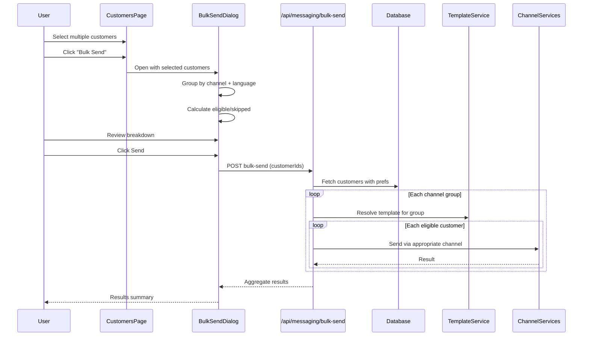
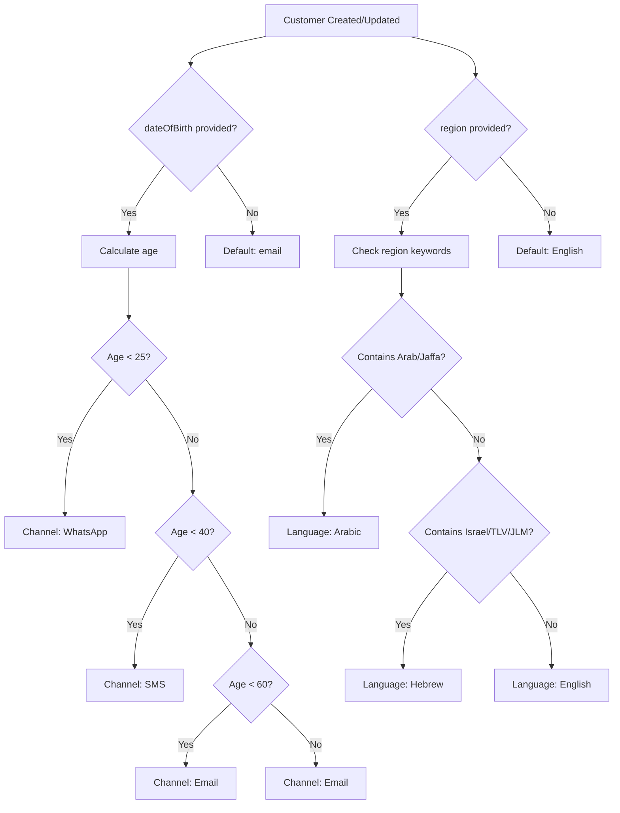

# SCRUM-10: Customer Communication Preferences with Manual Send Actions

## Design Document for AI Agent Implementation

---

## 1. Problem Statement

The PayDay system needs to enable customer-level communication preferences and manual send actions aligned with the Lovable UX reference. Currently:
- Customer preferences exist in the database but are not editable via UI
- Manual send dialog defaults to hardcoded values (`en`, `calm`) instead of customer preferences
- No bulk generation/collection functionality exists
- No automatic decision logic determines preferred channel/language

## 2. Business Goals

1. **Store customer communication preferences** on the Customer entity
2. **Automatically determine** preferred channel and language based on customer attributes
3. **Respect preferences** in both Bulk Generation and manual sends
4. **Allow manual sending** from the Customer record using the recommended channel
5. **Reduce manual decision-making** and improve collection effectiveness

## 3. Non-Goals

- Template authoring UI (already implemented)
- Payment processing changes
- Customer segmentation logic changes
- Multi-tenant support (out of scope for this task)

---

## 4. Current State Analysis

### 4.1 Data Model (Already Exists)

The Prisma schema at `server/prisma/schema.prisma` already has the required fields:

```prisma
model Customer {
  // ... other fields
  preferredLanguage TemplateLanguage?    @map("preferred_language")  // en, he, ar
  preferredTone     TemplateTone?        @map("preferred_tone")      // calm, medium, heavy
  preferredChannel  NotificationChannel? @map("preferred_channel")   // sms, email, whatsapp, call_task
}
```

Enums available:
- `TemplateLanguage`: `en`, `he`, `ar`
- `TemplateTone`: `calm`, `medium`, `heavy`
- `NotificationChannel`: `sms`, `email`, `whatsapp`, `call_task`

### 4.2 Backend Messaging (Partially Implemented)

**File**: `server/src/controllers/messaging.controller.ts`

- `POST /api/messaging/send-reminder` - Single customer send (working)
- `POST /api/messaging/preview-reminder` - Template preview (working)
- Resolves language/tone from customer preferences (lines 111-112):
  ```typescript
  language = language || customer.preferredLanguage || 'en';
  tone = tone || customer.preferredTone || 'calm';
  ```

**Missing**: Bulk send endpoint, automatic preference assignment

### 4.3 Frontend UI (Partially Implemented)

**File**: `client/src/pages/CustomersPage.tsx`

**Implemented**:
- Manual send actions menu (Email, SMS, WhatsApp, Voice Call) - lines 946-981
- Send notification dialog with language/tone selection - lines 1041-1151
- Template preview integration

**Missing**:
- Preference fields in create/edit customer forms
- Preference display in customer table
- Defaults from customer preferences (currently hardcoded to `'en'`, `'calm'`)
- Bulk send UI and functionality

### 4.4 Lovable Reference Implementation

| Component | File | Key Features |
|-----------|------|--------------|
| Bulk Collection Dialog | `LovableApp/src/components/customers/BulkCollectionDialog.tsx` | Groups by channel, language breakdown, segment-to-tone mapping |
| Edit Customer Dialog | `LovableApp/src/components/customers/EditCustomerDialog.tsx` | Preference fields (channel, language) in form |
| Age-based Logic | `LovableApp/supabase/migrations/20260105190828_*.sql` | `recommend_channel_by_age()` function |

---

## 5. Proposed Solution

### 5.1 Automatic Decision Logic (Age-Based)

Implement automatic preference assignment based on customer age:

```typescript
// server/src/services/preference.service.ts (NEW FILE)

export function recommendChannelByAge(birthDate: Date | null): NotificationChannel {
  if (!birthDate) return 'email'; // Default

  const age = calculateAge(birthDate);
  
  if (age < 25) return 'whatsapp';      // Youth prefer messaging apps
  if (age < 40) return 'sms';           // Working age prefer SMS
  if (age < 60) return 'email';         // Middle age prefer email
  return 'email';                        // Seniors prefer email (easier to read)
}

export function recommendLanguageByRegion(region: string | null): TemplateLanguage {
  if (!region) return 'he'; // Default
  
  const regionLower = region.toLowerCase();
  if (regionLower.includes('arab') || regionLower.includes('jaffa')) return 'ar';
  if (regionLower.includes('israel') || regionLower.includes('tel aviv') || regionLower.includes('jerusalem')) return 'he';
  return 'he';
}

function calculateAge(birthDate: Date): number {
  const today = new Date();
  let age = today.getFullYear() - birthDate.getFullYear();
  const monthDiff = today.getMonth() - birthDate.getMonth();
  if (monthDiff < 0 || (monthDiff === 0 && today.getDate() < birthDate.getDate())) {
    age--;
  }
  return age;
}
```

### 5.2 Backend API Changes

#### 5.2.1 Extend Customer Controller

**File**: `server/src/controllers/customers.controller.ts`

Add preference fields to create/update endpoints and apply auto-logic when not provided:

```typescript
// In createCustomer handler:
const preferredChannel = data.preferredChannel || recommendChannelByAge(data.dateOfBirth);
const preferredLanguage = data.preferredLanguage || recommendLanguageByRegion(data.region);

// In updateCustomer handler:
// Recalculate if dateOfBirth or region changes and preference was auto-assigned
```

#### 5.2.2 New Bulk Send Endpoint

**File**: `server/src/controllers/messaging.controller.ts`

Add new endpoint `POST /api/messaging/bulk-send`:

```typescript
const bulkSendSchema = z.object({
  customerIds: z.array(z.string().uuid()).min(1).max(500),
  templateKey: z.string().optional().default('debt_reminder'),
  overrideChannel: z.enum(['email', 'whatsapp', 'sms', 'call_task']).optional(),
  overrideLanguage: z.enum(['en', 'he', 'ar']).optional(),
  overrideTone: z.enum(['calm', 'medium', 'heavy']).optional(),
});

async bulkSend(req: Request, res: Response) {
  const { customerIds, templateKey, overrideChannel, overrideLanguage, overrideTone } = validation.data;
  
  // Fetch all customers with preferences
  const customers = await prisma.customer.findMany({
    where: { 
      id: { in: customerIds },
      status: { not: 'blocked' }
    },
    include: { debts: { where: { status: { in: ['open', 'in_collection'] } } } }
  });
  
  // Group by channel + language for efficient processing
  const groups = groupCustomersByPreferences(customers, overrideChannel, overrideLanguage);
  
  // Process each group
  const results = { sent: 0, failed: 0, skipped: 0, errors: [] };
  
  for (const group of groups) {
    for (const customer of group.customers) {
      // Check eligibility
      if (!isEligibleForChannel(customer, group.channel)) {
        results.skipped++;
        continue;
      }
      
      // Send using existing single-send logic
      try {
        await sendToCustomer(customer, group.channel, group.language, templateKey);
        results.sent++;
      } catch (error) {
        results.failed++;
        results.errors.push({ customerId: customer.id, error: error.message });
      }
    }
  }
  
  return res.json({ success: true, data: results });
}
```

#### 5.2.3 Update Routes

**File**: `server/src/routes/messaging.routes.ts`

```typescript
router.post('/bulk-send', messagingController.bulkSend);
```

### 5.3 Frontend UI Changes

#### 5.3.1 Add Preference Fields to Customer Forms

**File**: `client/src/pages/CustomersPage.tsx`

1. **Extend Customer interface**:
```typescript
interface Customer {
  // ... existing fields
  preferredLanguage: 'en' | 'he' | 'ar' | null;
  preferredTone: 'calm' | 'medium' | 'heavy' | null;
  preferredChannel: 'sms' | 'email' | 'whatsapp' | 'call_task' | null;
}

interface NewCustomerForm {
  // ... existing fields
  preferredLanguage: 'en' | 'he' | 'ar' | '';
  preferredTone: 'calm' | 'medium' | 'heavy' | '';
  preferredChannel: 'sms' | 'email' | 'whatsapp' | 'call_task' | '';
  dateOfBirth: string;
  region: string;
}
```

2. **Add form fields in Add/Edit dialogs**:
```tsx
<Stack direction="row" spacing={2}>
  <FormControl size="small" sx={{ flex: 1 }}>
    <InputLabel>{t('customers.preferredChannel')}</InputLabel>
    <Select
      value={formData.preferredChannel}
      label={t('customers.preferredChannel')}
      onChange={(e) => setFormData({ ...formData, preferredChannel: e.target.value })}
    >
      <MenuItem value="">{t('common.auto')}</MenuItem>
      <MenuItem value="email">{t('common.email')}</MenuItem>
      <MenuItem value="sms">SMS</MenuItem>
      <MenuItem value="whatsapp">WhatsApp</MenuItem>
      <MenuItem value="call_task">{t('common.voiceCall')}</MenuItem>
    </Select>
  </FormControl>
  <FormControl size="small" sx={{ flex: 1 }}>
    <InputLabel>{t('customers.preferredLanguage')}</InputLabel>
    <Select
      value={formData.preferredLanguage}
      label={t('customers.preferredLanguage')}
      onChange={(e) => setFormData({ ...formData, preferredLanguage: e.target.value })}
    >
      <MenuItem value="">{t('common.auto')}</MenuItem>
      <MenuItem value="en">English</MenuItem>
      <MenuItem value="he">עברית</MenuItem>
      <MenuItem value="ar">العربية</MenuItem>
    </Select>
  </FormControl>
</Stack>
```

3. **Display preferences in table** (add columns or badges):
```tsx
<TableCell>
  {customer.preferredChannel && (
    <Chip 
      size="small" 
      label={getChannelLabel(customer.preferredChannel)} 
      icon={getChannelIcon(customer.preferredChannel)}
    />
  )}
</TableCell>
```

#### 5.3.2 Default Manual Send Dialog to Customer Preferences

**File**: `client/src/pages/CustomersPage.tsx`

Modify `handleSendNotification` to use customer preferences as defaults:

```typescript
const handleSendNotification = (type: 'email' | 'whatsapp' | 'sms' | 'call_task') => {
  handleActionsClose();
  setNotificationType(type);
  
  // Use customer preferences as defaults instead of hardcoded values
  const defaultLanguage = selectedCustomer?.preferredLanguage || 'he';
  const defaultTone = selectedCustomer?.preferredTone || 'calm';
  
  setSelectedLanguage(defaultLanguage);
  setSelectedTone(defaultTone);
  setTemplatePreview(null);
  setNotificationDialogOpen(true);
  
  if (selectedCustomer) {
    fetchTemplatePreview(selectedCustomer.id, type, defaultLanguage, defaultTone);
  }
};
```

#### 5.3.3 Add Bulk Send UI

Create new component or extend CustomersPage with:

1. **Checkbox selection for customers**
2. **"Bulk Send" button** (appears when customers selected)
3. **BulkSendDialog component**:

```tsx
// client/src/components/BulkSendDialog.tsx (NEW FILE)

interface BulkSendDialogProps {
  open: boolean;
  onClose: () => void;
  selectedCustomers: Customer[];
  onComplete: () => void;
}

export function BulkSendDialog({ open, onClose, selectedCustomers, onComplete }: BulkSendDialogProps) {
  const [sending, setSending] = useState(false);
  
  // Group by channel for preview
  const channelGroups = useMemo(() => {
    const groups = { email: [], sms: [], whatsapp: [], call_task: [] };
    selectedCustomers.forEach(c => {
      const channel = c.preferredChannel || 'email';
      groups[channel].push(c);
    });
    return Object.entries(groups)
      .filter(([_, customers]) => customers.length > 0)
      .map(([channel, customers]) => ({
        channel,
        total: customers.length,
        eligible: customers.filter(c => isEligible(c, channel)).length,
        skipped: customers.filter(c => !isEligible(c, channel)).length,
      }));
  }, [selectedCustomers]);
  
  const handleSend = async () => {
    setSending(true);
    try {
      const response = await fetch('/api/messaging/bulk-send', {
        method: 'POST',
        headers: { 'Content-Type': 'application/json' },
        body: JSON.stringify({
          customerIds: selectedCustomers.map(c => c.id),
          templateKey: 'debt_reminder',
        }),
      });
      const data = await response.json();
      // Show results toast
      onComplete();
      onClose();
    } finally {
      setSending(false);
    }
  };
  
  return (
    <Dialog open={open} onClose={onClose} maxWidth="md" fullWidth>
      <DialogTitle>Bulk Send Notifications</DialogTitle>
      <DialogContent>
        {/* Channel breakdown */}
        {/* Language breakdown */}
        {/* Eligible/skipped summary */}
      </DialogContent>
      <DialogActions>
        <Button onClick={onClose}>Cancel</Button>
        <Button onClick={handleSend} disabled={sending} variant="contained">
          {sending ? 'Sending...' : 'Send'}
        </Button>
      </DialogActions>
    </Dialog>
  );
}
```

### 5.4 Preference Resolution Order

```
1. Explicit override in request (for manual sends)
   ↓ (if not provided)
2. Customer's saved preference (preferredChannel, preferredLanguage)
   ↓ (if not set)
3. Auto-calculated value (age-based channel, region-based language)
   ↓ (if cannot calculate)
4. System defaults: channel = 'email', language = 'he', tone = 'calm'
```

---

## 6. API Specifications

### 6.1 POST /api/messaging/bulk-send

**Request:**
```json
{
  "customerIds": ["uuid1", "uuid2", ...],
  "templateKey": "debt_reminder",
  "overrideChannel": "email",       // optional - forces all to use this channel
  "overrideLanguage": "en",         // optional - forces all to use this language
  "overrideTone": "calm"            // optional - forces all to use this tone
}
```

**Response:**
```json
{
  "success": true,
  "data": {
    "sent": 45,
    "failed": 3,
    "skipped": 7,
    "breakdown": {
      "email": { "sent": 20, "failed": 1, "skipped": 2 },
      "sms": { "sent": 15, "failed": 1, "skipped": 3 },
      "whatsapp": { "sent": 10, "failed": 1, "skipped": 2 }
    },
    "errors": [
      { "customerId": "uuid", "error": "Invalid phone number" }
    ]
  }
}
```

### 6.2 PATCH /api/customers/:id (Updated)

**Request body now accepts:**
```json
{
  "preferredChannel": "sms",
  "preferredLanguage": "he",
  "preferredTone": "medium",
  "dateOfBirth": "1990-05-15",
  "region": "Tel Aviv"
}
```

---

## 7. Data Flow Diagrams

### 7.1 Manual Send Flow



### 7.2 Bulk Send Flow



### 7.3 Preference Auto-Assignment Flow



---

## 8. Implementation Tasks

### Phase 1: Backend Foundation
- [ ] Create `server/src/services/preference.service.ts` with age/region logic
- [ ] Update customer create/update handlers to apply auto-logic
- [ ] Add `GET /api/customers/:id` response to include preferences
- [ ] Ensure customer list API returns preference fields

### Phase 2: Manual Send Improvements
- [ ] Update `CustomersPage.tsx` to use customer preferences as dialog defaults
- [ ] Ensure Customer interface includes preference fields
- [ ] Update API fetch to include preferences in customer data

### Phase 3: UI Preference Management
- [ ] Add preference fields to Add Customer dialog
- [ ] Add preference fields to Edit Customer dialog
- [ ] Add preference columns/badges to customer table
- [ ] Add i18n translations for new UI elements

### Phase 4: Bulk Send Feature
- [ ] Create `POST /api/messaging/bulk-send` endpoint
- [ ] Create `BulkSendDialog.tsx` component
- [ ] Add customer selection checkboxes to table
- [ ] Add "Bulk Send" action button
- [ ] Implement grouping logic and eligibility checks

### Phase 5: Testing & Polish
- [ ] Unit tests for preference service
- [ ] API integration tests for bulk send
- [ ] UI component tests for dialogs
- [ ] End-to-end test for complete flow

---

## 9. Edge Cases & Error Handling

| Scenario | Handling |
|----------|----------|
| Customer missing phone for SMS/WhatsApp/Voice | Skip, include in `skipped` count |
| Customer missing email for Email channel | Skip, include in `skipped` count |
| Customer status is `do_not_contact` | Skip entirely (not included in bulk) |
| Customer status is `blocked` | Skip entirely |
| No template found for channel/language/tone | Fallback: try English → try calm tone → error |
| Channel service unavailable | Include in `failed`, continue with others |
| Rate limiting exceeded | Implement backoff, partial success |
| Bulk send > 500 customers | Reject request, suggest batching |

---

## 10. Acceptance Criteria

1. **Customer entity includes**: Phone, Preferred Channel, Preferred Language, Preferred Tone
2. **Default language** is Hebrew when not set
3. **Preferred Channel** supports: SMS, WhatsApp, Email, Voice Call
4. **Manual send actions** are available from Customer record menu
5. **Manual send defaults** to customer's recommended channel and language
6. **User can override** channel/language/tone without changing saved preference
7. **Bulk Generation respects** customer-level preferences
8. **Skipped customers** (missing contact info) are reported in results
9. **Age-based auto-logic** is applied when preferences not manually set
10. **Behavior aligns** with Lovable reference implementation

---

## 11. File Reference Summary

### Files to Modify

| File | Changes |
|------|---------|
| `server/src/controllers/customers.controller.ts` | Add auto-preference logic on create/update |
| `server/src/controllers/messaging.controller.ts` | Add bulk send endpoint |
| `server/src/routes/messaging.routes.ts` | Register bulk send route |
| `client/src/pages/CustomersPage.tsx` | Add preference fields, defaults, bulk UI |

### Files to Create

| File | Purpose |
|------|---------|
| `server/src/services/preference.service.ts` | Age/region-based preference logic |
| `client/src/components/BulkSendDialog.tsx` | Bulk send confirmation dialog |

### Reference Files (Lovable)

| File | Use For |
|------|---------|
| `LovableApp/src/components/customers/BulkCollectionDialog.tsx` | UI patterns, grouping logic |
| `LovableApp/src/components/customers/EditCustomerDialog.tsx` | Preference form fields |
| `LovableApp/supabase/migrations/20260105190828_*.sql` | Age-based recommendation SQL |

---

## 12. Test Plan

### 12.1 Unit Tests

#### Preference Service (`server/src/services/preference.service.test.ts`)

```typescript
describe('PreferenceService', () => {
  describe('recommendChannelByAge', () => {
    it('returns whatsapp for age < 25', () => {
      const birthDate = new Date('2005-01-15'); // ~21 years old
      expect(recommendChannelByAge(birthDate)).toBe('whatsapp');
    });
    
    it('returns sms for age 25-39', () => {
      const birthDate = new Date('1990-06-20'); // ~36 years old
      expect(recommendChannelByAge(birthDate)).toBe('sms');
    });
    
    it('returns email for age 40-59', () => {
      const birthDate = new Date('1975-03-10'); // ~51 years old
      expect(recommendChannelByAge(birthDate)).toBe('email');
    });
    
    it('returns email for age >= 60', () => {
      const birthDate = new Date('1960-12-01'); // ~66 years old
      expect(recommendChannelByAge(birthDate)).toBe('email');
    });
    
    it('returns email when birthDate is null', () => {
      expect(recommendChannelByAge(null)).toBe('email');
    });
  });

  describe('recommendLanguageByRegion', () => {
    it('returns arabic for regions containing "arab"', () => {
      expect(recommendLanguageByRegion('Arab District')).toBe('ar');
      expect(recommendLanguageByRegion('Jaffa')).toBe('ar');
    });
    
    it('returns hebrew for Israeli regions', () => {
      expect(recommendLanguageByRegion('Tel Aviv')).toBe('he');
      expect(recommendLanguageByRegion('Jerusalem')).toBe('he');
      expect(recommendLanguageByRegion('Israel Central')).toBe('he');
    });
    
    it('returns english for other/null regions', () => {
      expect(recommendLanguageByRegion('New York')).toBe('he');
      expect(recommendLanguageByRegion(null)).toBe('he');
    });
  });
});
```

#### Template Service Resolution Tests

```typescript
describe('TemplateService', () => {
  describe('resolveTemplate fallback', () => {
    it('returns exact match when available');
    it('falls back to Hebrew when requested language not found');
    it('falls back to calm tone when requested tone not found');
    it('returns null when no fallback available');
  });
});
```

### 12.2 API Integration Tests

#### Bulk Send Endpoint (`server/src/__tests__/messaging.bulk.test.ts`)

```typescript
describe('POST /api/messaging/bulk-send', () => {
  it('sends to all eligible customers respecting preferences', async () => {
    // Setup: 3 customers with different preferences
    // Action: Call bulk-send
    // Assert: Each received message via their preferred channel
  });
  
  it('skips customers without required contact info', async () => {
    // Setup: Customer with email channel but no email address
    // Assert: Customer in skipped count
  });
  
  it('skips do_not_contact customers', async () => {
    // Setup: Customer with status do_not_contact
    // Assert: Not included in any send attempt
  });
  
  it('respects override parameters when provided', async () => {
    // Setup: Customers with various preferences
    // Action: Call with overrideChannel='email'
    // Assert: All sent via email regardless of preference
  });
  
  it('returns breakdown by channel', async () => {
    // Assert response includes breakdown.email, breakdown.sms, etc.
  });
  
  it('rejects requests with > 500 customers', async () => {
    // Assert: 400 error with appropriate message
  });
  
  it('handles partial failures gracefully', async () => {
    // Setup: Mock one channel service to fail
    // Assert: Continues with others, returns accurate counts
  });
});
```

#### Customer CRUD with Preferences

```typescript
describe('Customer API with preferences', () => {
  it('creates customer with auto-assigned preferences based on age/region');
  it('updates preferences when explicitly provided');
  it('recalculates auto-preferences when dateOfBirth changes');
  it('includes preferences in list response');
  it('includes preferences in single customer response');
});
```

### 12.3 Frontend Component Tests

#### BulkSendDialog (`client/src/components/__tests__/BulkSendDialog.test.tsx`)

```typescript
describe('BulkSendDialog', () => {
  it('displays correct channel grouping');
  it('shows eligible vs skipped counts per channel');
  it('displays language breakdown');
  it('disables send button when no eligible customers');
  it('shows loading state during send');
  it('calls onComplete after successful send');
  it('displays error toast on failure');
});
```

#### Customer Form Preference Fields

```typescript
describe('Customer form preferences', () => {
  it('renders channel dropdown with all options');
  it('renders language dropdown with all options');
  it('includes "Auto" option in dropdowns');
  it('submits preference values correctly');
  it('populates existing preferences when editing');
});
```

#### Manual Send Dialog Defaults

```typescript
describe('SendNotificationDialog', () => {
  it('defaults language to customer preferredLanguage');
  it('defaults tone to customer preferredTone');
  it('falls back to "he" when no preference set');
  it('falls back to "calm" when no tone preference set');
  it('updates preview when language/tone changed');
  it('does not persist override to customer record');
});
```

### 12.4 End-to-End Tests

#### Manual Send Flow

```typescript
describe('E2E: Manual Send', () => {
  it('complete flow: customer with preferences → dialog defaults → send → success', async () => {
    // 1. Create customer with preferredLanguage='he', preferredChannel='sms'
    // 2. Navigate to customers page
    // 3. Open actions menu for customer
    // 4. Click "Send SMS"
    // 5. Verify dialog shows language='he' by default
    // 6. Click send
    // 7. Verify success toast
    // 8. Verify notification created in DB
  });
});
```

#### Bulk Send Flow

```typescript
describe('E2E: Bulk Send', () => {
  it('complete flow: select customers → bulk dialog → send → results', async () => {
    // 1. Create 5 customers with various preferences
    // 2. Navigate to customers page
    // 3. Select 3 customers
    // 4. Click "Bulk Send" button
    // 5. Verify breakdown matches customer preferences
    // 6. Click send
    // 7. Verify results match expected sent/skipped
    // 8. Verify notifications created in DB
  });
});
```

### 12.5 Manual QA Checklist

#### Customer Preferences

- [ ] Can create customer without specifying preferences (auto-assigned)
- [ ] Can create customer with explicit preferences
- [ ] Can edit customer preferences
- [ ] Preferences display correctly in customer table
- [ ] Preferences display correctly in customer detail view
- [ ] Auto-assignment uses correct age thresholds
- [ ] Auto-assignment uses correct region keywords

#### Manual Send

- [ ] Dialog opens with customer's preferred language pre-selected
- [ ] Dialog opens with customer's preferred tone pre-selected
- [ ] Can change language/tone in dialog without affecting saved preference
- [ ] Send Email disabled when no email address
- [ ] Send SMS/WhatsApp/Voice disabled when no phone number
- [ ] Template preview updates when language/tone changed
- [ ] Success toast appears after send
- [ ] Error handling works for failed sends

#### Bulk Send

- [ ] Checkbox selection works in customer table
- [ ] "Bulk Send" button appears when customers selected
- [ ] Channel breakdown shows correct counts
- [ ] Language breakdown shows correct counts
- [ ] Eligible/skipped counts are accurate
- [ ] Skipped reason is clear (missing contact info)
- [ ] Send executes for all eligible customers
- [ ] Results summary is accurate
- [ ] Can cancel dialog without sending

#### Edge Cases

- [ ] Customer with no preferences uses defaults
- [ ] Customer with status do_not_contact cannot be messaged
- [ ] Customer with status blocked cannot be messaged
- [ ] Missing template falls back correctly
- [ ] RTL layout works for Hebrew/Arabic users
- [ ] Translations are complete for all new strings

---

## 13. Rollout Plan

### Phase 1: Database Ready (No UI)
1. Deploy preference service with auto-logic
2. Backfill existing customers with auto-calculated preferences
3. Verify existing manual send still works

### Phase 2: UI Visibility
1. Deploy preference display in customer table/detail
2. Deploy preference fields in edit form
3. Verify preferences round-trip correctly

### Phase 3: Enhanced Defaults
1. Deploy manual send dialog preference defaults
2. Monitor for issues with existing workflows

### Phase 4: Bulk Send
1. Deploy bulk send endpoint
2. Deploy bulk send UI
3. Limited rollout (feature flag) for internal testing
4. Full rollout after validation

### Migration Script (Backfill)

```sql
-- Backfill preferred_channel based on date_of_birth
UPDATE customers
SET preferred_channel = CASE
  WHEN date_of_birth IS NULL THEN 'email'
  WHEN EXTRACT(YEAR FROM AGE(date_of_birth)) < 25 THEN 'whatsapp'
  WHEN EXTRACT(YEAR FROM AGE(date_of_birth)) < 40 THEN 'sms'
  ELSE 'email'
END
WHERE preferred_channel IS NULL;

-- Backfill preferred_language based on region
UPDATE customers
SET preferred_language = CASE
  WHEN region IS NULL THEN 'he'
  WHEN LOWER(region) LIKE '%arab%' OR LOWER(region) LIKE '%jaffa%' THEN 'ar'
  WHEN LOWER(region) LIKE '%israel%' OR LOWER(region) LIKE '%tel aviv%' OR LOWER(region) LIKE '%jerusalem%' THEN 'he'
  ELSE 'he'
END
WHERE preferred_language IS NULL;

-- Set default tone
UPDATE customers
SET preferred_tone = 'calm'
WHERE preferred_tone IS NULL;
```

---

## 14. Translations Required

Add to `client/src/i18n/locales/en.json` and `he.json`:

```json
{
  "customers": {
    "preferredChannel": "Preferred Channel",
    "preferredLanguage": "Preferred Language", 
    "preferredTone": "Preferred Tone",
    "noPhoneNumber": "No phone number",
    "noEmailAddress": "No email address"
  },
  "bulkSend": {
    "title": "Bulk Send Notifications",
    "channelBreakdown": "Channel Breakdown",
    "languageBreakdown": "Language Breakdown",
    "eligible": "Eligible",
    "skipped": "Skipped",
    "totalToSend": "Total to Send",
    "sending": "Sending...",
    "completed": "Bulk send completed",
    "sentCount": "Sent: {{count}}",
    "failedCount": "Failed: {{count}}",
    "skippedCount": "Skipped: {{count}}"
  },
  "common": {
    "auto": "Auto",
    "voiceCall": "Voice Call"
  }
}
```
