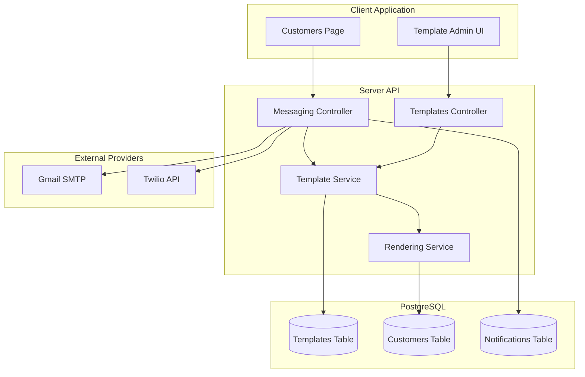
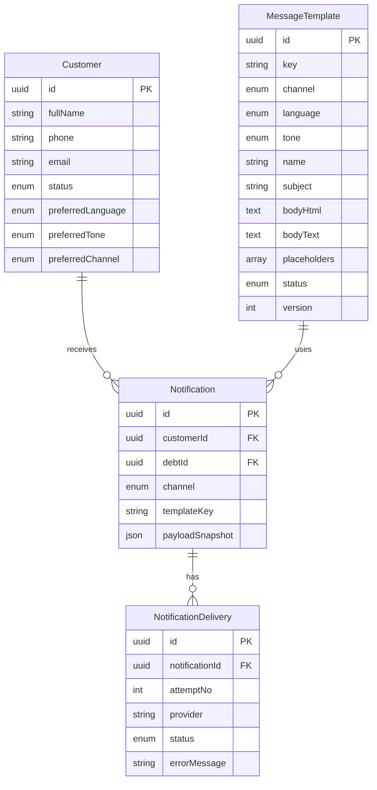
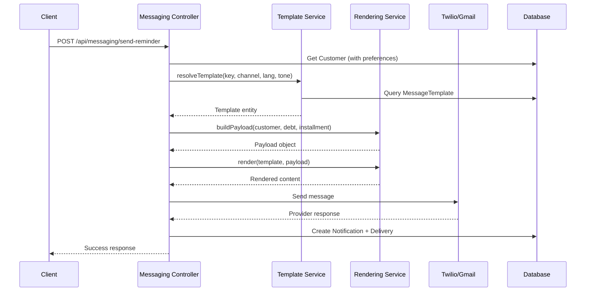
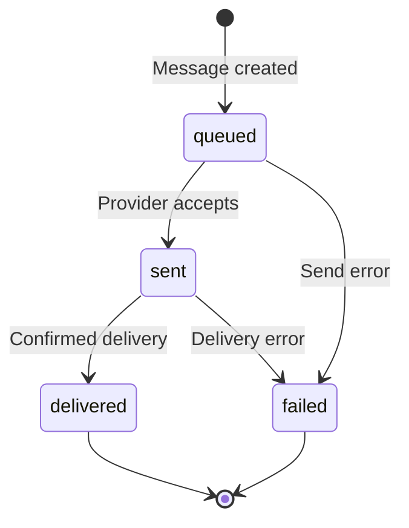

# SCRUM-11: Multichannel Outreach Templates Design Document

**Author:** AI Agent  
**Date:** January 26, 2026  
**Status:** Draft  
**Ticket:** [SCRUM-11](https://payday-ai.atlassian.net/browse/SCRUM-11)

---

## Instructions for AI Agent Implementation

This document is designed to be self-contained for AI agent implementation. Follow these steps:

### Required Files
1. **This design document** - Architecture, API specs, data model, UI requirements
2. **[`server/prisma/seed-templates.ts`](../server/prisma/seed-templates.ts)** - All 36 template contents ready for database seeding

### Implementation Order
1. **Database**: Apply Prisma schema changes (Section 4)
2. **Seed Data**: Run template seeding script
3. **Backend Services**: Implement template service, SMS service, voice service (Sections 5, 6, 8)
4. **API Routes**: Add template CRUD and extend messaging endpoints (Section 5)
5. **Frontend**: Build template admin UI and update customers page (Section 7)
6. **Testing**: Follow test strategy (Section 10)

### Key Dependencies
- Prisma ORM (existing)
- Handlebars (new - for template rendering)
- Twilio SDK (existing for WhatsApp, extend for SMS/Voice)

### Environment Variables Required
```env
# Existing
TWILIO_ACCOUNT_SID=xxx
TWILIO_AUTH_TOKEN=xxx
TWILIO_WHATSAPP_NUMBER=+xxx

# New
TWILIO_SMS_NUMBER=+xxx
TWILIO_VOICE_NUMBER=+xxx
COMPANY_NAME=PayDay AI
SUPPORT_PHONE=+xxx
SUPPORT_EMAIL=support@example.com
BUSINESS_HOURS=9 AM - 5 PM
PAYMENT_BASE_URL=https://pay.example.com
```

---

## Table of Contents

1. [Summary](#1-summary)
2. [Goals and Non-Goals](#2-goals-and-non-goals)
3. [Current State Analysis](#3-current-state-analysis)
4. [Data Model](#4-data-model)
5. [API Design](#5-api-design)
6. [Template Rendering & Placeholders](#6-template-rendering--placeholders)
7. [UI: Template Admin](#7-ui-template-admin)
8. [Provider Integrations](#8-provider-integrations)
9. [Security & Privacy](#9-security--privacy)
10. [Testing Strategy](#10-testing-strategy)
11. [Rollout Plan](#11-rollout-plan)
12. [Open Questions](#12-open-questions)

---

## 1. Summary

This document describes the design for implementing **Multichannel Outreach Templates** in PayDay AI. The feature enables ready-to-use message templates for **Email (HTML)**, **WhatsApp**, **SMS**, and **Voice Call** across three languages (**English**, **Hebrew**, **Arabic**) and three tones (**Calm**, **Medium**, **Heavy**).

Key capabilities:
- **Database-managed templates** with admin UI for CRUD operations
- **Customer preferences** for language and tone with per-request overrides
- **Twilio integration** for SMS and Voice Call delivery
- **Template rendering engine** with consistent placeholder substitution
- **Delivery tracking** via existing `NotificationDelivery` infrastructure

### High-Level Architecture



---

## 2. Goals and Non-Goals

### Goals

1. **Template Storage**: Store all message templates in the database with support for channel, language, tone, and versioning
2. **Multi-Language Support**: Support English, Hebrew, and Arabic with proper RTL handling
3. **Tone Escalation**: Support Calm, Medium, and Heavy tones for escalating collection pressure
4. **Customer Preferences**: Store preferred language and tone on customer records with API override capability
5. **SMS Delivery**: Implement Twilio SMS sending with delivery tracking
6. **Voice Call Scripts**: Implement Twilio Programmable Voice for automated calls with TwiML generation
7. **Template Admin UI**: Provide basic CRUD interface for managing templates
8. **Preview Capability**: Allow template preview with sample data before sending
9. **Placeholder Validation**: Validate that templates contain required placeholders

### Non-Goals

1. **Template Approval Workflow**: No multi-step approval process for template changes (future enhancement)
2. **A/B Testing**: No built-in template A/B testing capability
3. **Scheduling**: No scheduled send functionality (handled by separate workflow system)
4. **Template Localization Service**: No automatic translation; templates are manually created per language
5. **Voice Recording**: No custom voice recording; using text-to-speech only
6. **WhatsApp Template Approval**: WhatsApp Business API template pre-approval process is out of scope

---

## 3. Current State Analysis

### Existing Infrastructure

#### Database Schema (`server/prisma/schema.prisma`)

The current schema includes:

- **`Customer`**: Core customer entity with `fullName`, `phone`, `email`, `status`
- **`Debt`**: Customer obligations with `originalAmount`, `currency`, `currentBalance`, `status`
- **`Installment`**: Scheduled payments with `dueDate`, `amountDue`, `amountPaid`
- **`Notification`**: Outreach records with `channel`, `templateKey`, `payloadSnapshot`
- **`NotificationDelivery`**: Delivery attempts with `provider`, `status`, `errorMessage`
- **`NotificationChannel` enum**: `sms`, `email`, `whatsapp`, `call_task`

#### Email Service (`server/src/services/email.service.ts`)

- Uses **Nodemailer** with Gmail SMTP
- Has `sendEmail()` generic method and `sendDebtReminder()` with hardcoded HTML template
- Supports HTML and plain text
- **Gap**: Template is hardcoded, no language/tone selection

#### WhatsApp Service (`server/src/services/whatsapp.service.ts`)

- Uses **Twilio** for WhatsApp messaging
- Has `sendMessage()` generic and `sendDebtReminder()` with hardcoded text
- **Gap**: Template is hardcoded, no language/tone selection

#### Messaging Controller (`server/src/controllers/messaging.controller.ts`)

- `sendReminder()` endpoint accepts `customerId`, `channel` (email/whatsapp), `templateKey`
- Creates `Notification` and `NotificationDelivery` records
- Validates customer status (do_not_contact, blocked)
- **Gap**: No SMS/Voice support, no template resolution from DB, no language/tone params

#### Client UI (`client/src/pages/CustomersPage.tsx`)

- Actions menu with "Send Email Reminder" and "Send WhatsApp Reminder"
- Calls `POST /api/messaging/send-reminder` with hardcoded `templateKey: 'debt_reminder'`
- **Gap**: No language/tone selection, no SMS/Voice options

### Gaps vs SCRUM-11 Requirements

| Requirement | Current State | Gap |
|-------------|---------------|-----|
| Email HTML templates (9) | 1 hardcoded template | Need 9 DB templates |
| WhatsApp/SMS templates (9) | 1 hardcoded WhatsApp | Need 9 DB templates + SMS sending |
| Voice Call scripts (9) | None | Need templates + Twilio Voice integration |
| Language selection | None | Need customer.preferredLanguage + API param |
| Tone selection | None | Need customer.preferredTone + API param |
| Template management UI | None | Need admin CRUD page |
| Placeholders | Limited (customerName, totalDebt) | Need full placeholder set |

---

## 4. Data Model

### New Enums

```prisma
enum TemplateLanguage {
  en
  he
  ar
}

enum TemplateTone {
  calm
  medium
  heavy
}

enum TemplateStatus {
  draft
  active
  archived
}
```

### New Model: `MessageTemplate`

```prisma
/// Stores reusable message templates for outreach
model MessageTemplate {
  id          String              @id @default(uuid()) @db.Uuid
  
  // Template identification
  key         String              // e.g., "debt_reminder", "payment_confirmation"
  channel     NotificationChannel // email, sms, whatsapp, call_task
  language    TemplateLanguage
  tone        TemplateTone
  
  // Content
  name        String              // Human-readable name for UI
  description String?             // Admin notes
  subject     String?             // Email subject line (null for non-email)
  bodyHtml    String?             @map("body_html") @db.Text  // HTML body (email only)
  bodyText    String              @map("body_text") @db.Text  // Plain text / script
  
  // Metadata
  placeholders String[]           // List of placeholders used, e.g., ["CustomerName", "Amount"]
  status      TemplateStatus      @default(active)
  version     Int                 @default(1)
  
  // Audit
  createdBy   String              @map("created_by")
  updatedBy   String?             @map("updated_by")
  createdAt   DateTime            @default(now()) @map("created_at") @db.Timestamptz
  updatedAt   DateTime            @updatedAt @map("updated_at") @db.Timestamptz
  
  @@unique([key, channel, language, tone])
  @@index([channel])
  @@index([language])
  @@index([tone])
  @@index([status])
  @@map("message_templates")
}
```

### Customer Preferences Extension

Add to existing `Customer` model:

```prisma
model Customer {
  // ... existing fields ...
  
  // Communication preferences
  preferredLanguage TemplateLanguage? @map("preferred_language")
  preferredTone     TemplateTone?     @map("preferred_tone")
  preferredChannel  NotificationChannel? @map("preferred_channel")
  
  // ... existing relations ...
}
```

### Migration Strategy

1. **Migration 1**: Add enums and `MessageTemplate` table
2. **Migration 2**: Add preference columns to `Customer` table (nullable)
3. **Seed Script**: Insert the 36 templates from SCRUM-11 specification

### Entity Relationship Diagram



---

## 5. API Design

### Template Management Endpoints

#### `GET /api/templates`

List all templates with filtering.

**Query Parameters:**
| Parameter | Type | Description |
|-----------|------|-------------|
| `channel` | string | Filter by channel (email, sms, whatsapp, call_task) |
| `language` | string | Filter by language (en, he, ar) |
| `tone` | string | Filter by tone (calm, medium, heavy) |
| `status` | string | Filter by status (draft, active, archived) |
| `key` | string | Filter by template key |
| `page` | number | Page number (default: 1) |
| `limit` | number | Items per page (default: 20) |

**Response:**
```json
{
  "success": true,
  "data": [
    {
      "id": "uuid",
      "key": "debt_reminder",
      "channel": "email",
      "language": "en",
      "tone": "calm",
      "name": "Friendly Payment Reminder (English)",
      "subject": "Payment Reminder",
      "status": "active",
      "version": 1,
      "placeholders": ["CustomerName", "InvoiceNumber", "Amount"],
      "createdAt": "2026-01-26T10:00:00Z"
    }
  ],
  "pagination": {
    "page": 1,
    "limit": 20,
    "total": 36,
    "totalPages": 2
  }
}
```

#### `GET /api/templates/:id`

Get single template by ID.

#### `POST /api/templates`

Create new template.

**Request Body:**
```json
{
  "key": "debt_reminder",
  "channel": "email",
  "language": "en",
  "tone": "calm",
  "name": "Friendly Payment Reminder (English)",
  "description": "Calm tone reminder for first contact",
  "subject": "Friendly payment reminder",
  "bodyHtml": "<!doctype html>...",
  "bodyText": "Hi {CustomerName}...",
  "createdBy": "admin@payday.ai"
}
```

**Validation:**
- `key`, `channel`, `language`, `tone` combination must be unique
- `bodyText` is required for all channels
- `bodyHtml` and `subject` required for email channel
- Placeholders are auto-extracted from body content

#### `PUT /api/templates/:id`

Update existing template. Increments version automatically.

#### `DELETE /api/templates/:id`

Soft delete (sets status to `archived`).

#### `POST /api/templates/:id/preview`

Preview template with sample data.

**Request Body:**
```json
{
  "sampleData": {
    "CustomerName": "John Doe",
    "Amount": "1,500.00",
    "Currency": "USD",
    "InvoiceNumber": "INV-2026-001",
    "DueDate": "January 15, 2026",
    "DaysOverdue": "11",
    "PaymentLink": "https://pay.example.com/abc123",
    "SupportPhone": "+1-800-555-0123",
    "SupportEmail": "support@payday.ai",
    "BusinessHours": "9 AM - 5 PM EST",
    "CompanyName": "PayDay AI",
    "CaseId": "CASE-12345"
  }
}
```

**Response:**
```json
{
  "success": true,
  "data": {
    "subject": "Friendly payment reminder",
    "bodyHtml": "<!doctype html>...(rendered)...",
    "bodyText": "Hi John Doe..."
  }
}
```

### Extended Messaging Endpoints

#### `POST /api/messaging/send-reminder` (Updated)

**Request Body:**
```json
{
  "customerId": "uuid",
  "channel": "email",
  "templateKey": "debt_reminder",
  "language": "en",
  "tone": "calm",
  "debtId": "uuid",
  "installmentId": "uuid"
}
```

**Resolution Logic:**
1. If `language` not provided, use `customer.preferredLanguage` or default to `en`
2. If `tone` not provided, use `customer.preferredTone` or default to `calm`
3. Look up template by `(templateKey, channel, language, tone)`
4. Build payload from customer/debt/installment data
5. Render template with placeholders
6. Send via appropriate provider
7. Record `Notification` and `NotificationDelivery`

**Response:**
```json
{
  "success": true,
  "message": "Email reminder sent successfully to John Doe",
  "data": {
    "notificationId": "uuid",
    "messageId": "provider-message-id",
    "channel": "email",
    "recipient": "john@example.com",
    "templateUsed": {
      "key": "debt_reminder",
      "language": "en",
      "tone": "calm"
    }
  }
}
```

### New Routes Structure

```
server/src/routes/
├── templates.routes.ts    # NEW: Template CRUD
├── messaging.routes.ts    # UPDATED: Extended send-reminder
└── index.ts               # Register new routes
```

### API Flow Diagram



---

## 6. Template Rendering & Placeholders

### Placeholder Contract

All templates use curly-brace placeholders: `{PlaceholderName}`

| Placeholder | Description | Source |
|-------------|-------------|--------|
| `{CustomerName}` | Customer's full name | `customer.fullName` |
| `{CompanyName}` | Creditor company name | Environment variable or config |
| `{Amount}` | Debt amount (formatted) | `debt.currentBalance` |
| `{Currency}` | Currency code | `debt.currency` |
| `{InvoiceNumber}` | Invoice/debt reference | `debt.id` or external ref |
| `{DueDate}` | Payment due date | `installment.dueDate` |
| `{DaysOverdue}` | Days past due | Calculated from `dueDate` |
| `{PaymentLink}` | Unique payment URL | Generated per notification |
| `{SupportPhone}` | Support phone number | Environment variable |
| `{SupportEmail}` | Support email address | Environment variable |
| `{BusinessHours}` | Support availability | Environment variable |
| `{CaseId}` | Internal case reference | `notification.id` |
| `{UnsubscribeText}` | Opt-out instructions (SMS/WhatsApp) | Per-language constant |

### Unsubscribe Text by Language

```typescript
const UNSUBSCRIBE_TEXT = {
  en: "Reply STOP to opt out",
  he: "השב/י STOP להסרה",
  ar: "للإلغاء أرسل STOP"
};
```

### Rendering Service

Create `server/src/services/template.service.ts`:

```typescript
import Handlebars from 'handlebars';

interface TemplatePayload {
  CustomerName: string;
  CompanyName: string;
  Amount: string;
  Currency: string;
  InvoiceNumber: string;
  DueDate: string;
  DaysOverdue: string;
  PaymentLink: string;
  SupportPhone: string;
  SupportEmail: string;
  BusinessHours: string;
  CaseId: string;
  UnsubscribeText: string;
}

class TemplateService {
  /**
   * Build payload from customer, debt, and installment data
   */
  buildPayload(
    customer: Customer,
    debt?: Debt,
    installment?: Installment,
    notificationId?: string,
    language: TemplateLanguage = 'en'
  ): TemplatePayload {
    const dueDate = installment?.dueDate || new Date();
    const daysOverdue = Math.max(0, Math.floor(
      (Date.now() - new Date(dueDate).getTime()) / (1000 * 60 * 60 * 24)
    ));

    return {
      CustomerName: customer.fullName,
      CompanyName: process.env.COMPANY_NAME || 'PayDay AI',
      Amount: this.formatAmount(debt?.currentBalance || 0),
      Currency: debt?.currency || 'USD',
      InvoiceNumber: debt?.id?.slice(0, 8).toUpperCase() || 'N/A',
      DueDate: this.formatDate(dueDate, language),
      DaysOverdue: String(daysOverdue),
      PaymentLink: this.generatePaymentLink(customer.id, debt?.id),
      SupportPhone: process.env.SUPPORT_PHONE || '',
      SupportEmail: process.env.SUPPORT_EMAIL || '',
      BusinessHours: process.env.BUSINESS_HOURS || '9 AM - 5 PM',
      CaseId: notificationId?.slice(0, 8).toUpperCase() || '',
      UnsubscribeText: UNSUBSCRIBE_TEXT[language] || UNSUBSCRIBE_TEXT.en
    };
  }

  /**
   * Render template with payload using Handlebars
   */
  render(templateText: string, payload: TemplatePayload): string {
    // Convert {Placeholder} to {{Placeholder}} for Handlebars
    const handlebarsTemplate = templateText.replace(
      /\{(\w+)\}/g, 
      '{{$1}}'
    );
    const compiled = Handlebars.compile(handlebarsTemplate);
    return compiled(payload);
  }

  /**
   * Extract placeholders from template text
   */
  extractPlaceholders(templateText: string): string[] {
    const matches = templateText.matchAll(/\{(\w+)\}/g);
    return [...new Set([...matches].map(m => m[1]))];
  }

  /**
   * Validate template has all required placeholders
   */
  validatePlaceholders(
    templateText: string, 
    required: string[] = ['CustomerName', 'Amount']
  ): { valid: boolean; missing: string[] } {
    const used = this.extractPlaceholders(templateText);
    const missing = required.filter(r => !used.includes(r));
    return { valid: missing.length === 0, missing };
  }

  private formatAmount(amount: number | Decimal): string {
    return Number(amount).toLocaleString(undefined, {
      minimumFractionDigits: 2,
      maximumFractionDigits: 2
    });
  }

  private formatDate(date: Date, language: string): string {
    const locales = { en: 'en-US', he: 'he-IL', ar: 'ar-SA' };
    return new Date(date).toLocaleDateString(
      locales[language] || 'en-US',
      { year: 'numeric', month: 'long', day: 'numeric' }
    );
  }

  private generatePaymentLink(customerId: string, debtId?: string): string {
    const baseUrl = process.env.PAYMENT_BASE_URL || 'https://pay.payday.ai';
    const token = Buffer.from(`${customerId}:${debtId || ''}`).toString('base64url');
    return `${baseUrl}/${token}`;
  }
}
```

### Voice Call TwiML Generation

For voice calls, the template text is converted to TwiML with pauses:

```typescript
/**
 * Convert voice script to TwiML
 */
generateTwiML(script: string, language: string): string {
  // Map language to Twilio voice
  const voices = {
    en: 'Polly.Joanna',
    he: 'Polly.Dalia',     // Hebrew
    ar: 'Polly.Zeina'      // Arabic
  };

  // Replace [pause Xs] markers with TwiML pauses
  let ssml = script.replace(
    /\[pause (\d+)s?\]/gi,
    '<break time="$1s"/>'
  );

  return `<?xml version="1.0" encoding="UTF-8"?>
<Response>
  <Say voice="${voices[language] || voices.en}">
    <prosody rate="95%">${ssml}</prosody>
  </Say>
  <Gather numDigits="1" timeout="10" action="/api/voice/gather">
    <Say voice="${voices[language] || voices.en}">
      Press 1 for payment link. Press 2 for support.
    </Say>
  </Gather>
</Response>`;
}
```

---

## 7. UI: Template Admin

### Navigation

Add new entry to sidebar navigation in `client/src/components/SidebarNav.tsx`:

```typescript
{ 
  text: 'Templates', 
  icon: <ArticleIcon />, 
  path: '/templates' 
}
```

### Template Management Page

Create `client/src/pages/TemplatesPage.tsx` with the following features:

#### List View

- Filterable table with columns: Name, Channel, Language, Tone, Status, Updated
- Filter controls for channel, language, tone, status
- Search by name/key
- Actions: Edit, Preview, Archive

#### Create/Edit Dialog

- Form fields:
  - Key (e.g., "debt_reminder") - readonly for edit
  - Channel dropdown
  - Language dropdown
  - Tone dropdown
  - Name (display name)
  - Subject (email only)
  - Body HTML (email only) - code editor with syntax highlighting
  - Body Text - multiline text area
  - Status dropdown

- Placeholder insertion toolbar with buttons for each placeholder
- Live preview panel showing rendered template with sample data

#### Preview Modal

- Side-by-side view: template source and rendered output
- Editable sample data JSON
- Channel-specific preview (HTML for email, plain text for SMS/WhatsApp, script for voice)

### UI Wireframe

```
┌─────────────────────────────────────────────────────────────────────┐
│ Templates                                         [+ Add Template]  │
├─────────────────────────────────────────────────────────────────────┤
│ Channel: [All ▼]  Language: [All ▼]  Tone: [All ▼]  [🔍 Search...] │
├─────────────────────────────────────────────────────────────────────┤
│ ┌─────────────────────────────────────────────────────────────────┐ │
│ │ Name                    │ Channel │ Lang │ Tone   │ Status │ ⋮ │ │
│ ├─────────────────────────────────────────────────────────────────┤ │
│ │ Friendly Reminder (EN)  │ 📧 Email │ EN   │ Calm   │ Active │ ⋮ │ │
│ │ Friendly Reminder (HE)  │ 📧 Email │ HE   │ Calm   │ Active │ ⋮ │ │
│ │ Urgent Notice (EN)      │ 📧 Email │ EN   │ Medium │ Active │ ⋮ │ │
│ │ Final Warning (EN)      │ 📧 Email │ EN   │ Heavy  │ Active │ ⋮ │ │
│ │ SMS Reminder (EN)       │ 💬 SMS   │ EN   │ Calm   │ Active │ ⋮ │ │
│ │ Voice Script (EN)       │ 📞 Call  │ EN   │ Calm   │ Active │ ⋮ │ │
│ └─────────────────────────────────────────────────────────────────┘ │
│                                          Page 1 of 4  [<] [1] [>]   │
└─────────────────────────────────────────────────────────────────────┘
```

### Edit Dialog Wireframe

```
┌─────────────────────────────────────────────────────────────────────┐
│ Edit Template                                                  [X]  │
├─────────────────────────────────────────────────────────────────────┤
│ Key: debt_reminder          Channel: [Email ▼]                      │
│ Language: [English ▼]       Tone: [Calm ▼]                          │
│                                                                     │
│ Name: [Friendly Payment Reminder (English)                    ]     │
│                                                                     │
│ Subject: [Friendly payment reminder                           ]     │
│                                                                     │
│ Insert: [{CustomerName}] [{Amount}] [{DueDate}] [{PaymentLink}]...  │
│                                                                     │
│ ┌─ Body HTML ─────────────────┐ ┌─ Preview ──────────────────────┐  │
│ │ <!doctype html>             │ │ Friendly payment reminder      │  │
│ │ <html lang="en">            │ │                                │  │
│ │ <head>...                   │ │ Hi John Doe,                   │  │
│ │ <body>                      │ │                                │  │
│ │   Hi {CustomerName},        │ │ Invoice INV-001 for $1,500     │  │
│ │   Invoice {InvoiceNumber}   │ │ was due on Jan 15, 2026.       │  │
│ │   for {Currency} {Amount}   │ │                                │  │
│ │   was due on {DueDate}.     │ │ [Pay securely]                 │  │
│ └─────────────────────────────┘ └────────────────────────────────┘  │
│                                                                     │
│ Status: [Active ▼]                                                  │
│                                                                     │
│                                        [Cancel]  [Save Template]    │
└─────────────────────────────────────────────────────────────────────┘
```

### Customer Page Updates

Update `client/src/pages/CustomersPage.tsx` to include:

1. **Language/Tone selection in send dialog**:
   - Add dropdowns for language and tone in notification dialog
   - Pre-select based on customer preferences if set

2. **SMS and Voice options in actions menu**:
   - Add "Send SMS Reminder" option
   - Add "Make Voice Call" option

3. **Channel icons**:
   - 📧 Email
   - 💬 SMS (via WhatsApp icon or text message icon)
   - 📱 WhatsApp
   - 📞 Voice Call

---

## 8. Provider Integrations

### Twilio Configuration

#### Environment Variables

Add to `server/.env`:

```env
# Existing Twilio WhatsApp config
TWILIO_ACCOUNT_SID=ACxxxxxxxxxxxxxxxxxxxxxxxxxxxxxxxx
TWILIO_AUTH_TOKEN=xxxxxxxxxxxxxxxxxxxxxxxxxxxxxxxx
TWILIO_WHATSAPP_NUMBER=+14155238886

# New: SMS and Voice
TWILIO_SMS_NUMBER=+15551234567
TWILIO_VOICE_NUMBER=+15551234568
TWILIO_VOICE_WEBHOOK_URL=https://api.payday.ai/api/voice/callback
```

### SMS Service

Create `server/src/services/sms.service.ts`:

```typescript
import twilio from 'twilio';

class SMSService {
  private client: twilio.Twilio | null = null;
  private fromNumber: string = '';
  private initialized = false;

  async initialize(): Promise<void> {
    if (this.initialized) return;

    const accountSid = process.env.TWILIO_ACCOUNT_SID;
    const authToken = process.env.TWILIO_AUTH_TOKEN;
    const smsNumber = process.env.TWILIO_SMS_NUMBER;

    if (!accountSid || !authToken || !smsNumber) {
      console.warn('⚠️ SMS service not configured');
      return;
    }

    this.client = twilio(accountSid, authToken);
    this.fromNumber = smsNumber;
    this.initialized = true;
    console.log('✅ SMS service initialized');
  }

  async sendSMS(to: string, message: string): Promise<{
    success: boolean;
    messageSid?: string;
    error?: string;
  }> {
    if (!this.client) {
      await this.initialize();
    }

    if (!this.client) {
      return { success: false, error: 'SMS service not configured' };
    }

    try {
      const result = await this.client.messages.create({
        body: message,
        from: this.fromNumber,
        to: this.formatPhoneNumber(to),
        statusCallback: `${process.env.BASE_URL}/api/messaging/sms-status`
      });

      return { success: true, messageSid: result.sid };
    } catch (error) {
      return {
        success: false,
        error: error instanceof Error ? error.message : 'Unknown error'
      };
    }
  }

  private formatPhoneNumber(phone: string): string {
    let cleaned = phone.replace(/[^\d+]/g, '');
    if (!cleaned.startsWith('+')) {
      // Default to Israel country code
      if (cleaned.startsWith('0')) {
        cleaned = '+972' + cleaned.substring(1);
      } else {
        cleaned = '+' + cleaned;
      }
    }
    return cleaned;
  }
}

export default new SMSService();
```

### Voice Service

Create `server/src/services/voice.service.ts`:

```typescript
import twilio from 'twilio';

class VoiceService {
  private client: twilio.Twilio | null = null;
  private fromNumber: string = '';
  private initialized = false;

  async initialize(): Promise<void> {
    if (this.initialized) return;

    const accountSid = process.env.TWILIO_ACCOUNT_SID;
    const authToken = process.env.TWILIO_AUTH_TOKEN;
    const voiceNumber = process.env.TWILIO_VOICE_NUMBER;

    if (!accountSid || !authToken || !voiceNumber) {
      console.warn('⚠️ Voice service not configured');
      return;
    }

    this.client = twilio(accountSid, authToken);
    this.fromNumber = voiceNumber;
    this.initialized = true;
    console.log('✅ Voice service initialized');
  }

  async makeCall(
    to: string,
    twimlUrl: string,
    notificationId: string
  ): Promise<{
    success: boolean;
    callSid?: string;
    error?: string;
  }> {
    if (!this.client) {
      await this.initialize();
    }

    if (!this.client) {
      return { success: false, error: 'Voice service not configured' };
    }

    try {
      const call = await this.client.calls.create({
        to: this.formatPhoneNumber(to),
        from: this.fromNumber,
        url: twimlUrl,
        statusCallback: `${process.env.BASE_URL}/api/voice/status`,
        statusCallbackEvent: ['initiated', 'ringing', 'answered', 'completed'],
        statusCallbackMethod: 'POST',
        machineDetection: 'DetectMessageEnd',
        asyncAmd: 'true',
        asyncAmdStatusCallback: `${process.env.BASE_URL}/api/voice/amd`
      });

      return { success: true, callSid: call.sid };
    } catch (error) {
      return {
        success: false,
        error: error instanceof Error ? error.message : 'Unknown error'
      };
    }
  }

  private formatPhoneNumber(phone: string): string {
    let cleaned = phone.replace(/[^\d+]/g, '');
    if (!cleaned.startsWith('+')) {
      if (cleaned.startsWith('0')) {
        cleaned = '+972' + cleaned.substring(1);
      } else {
        cleaned = '+' + cleaned;
      }
    }
    return cleaned;
  }
}

export default new VoiceService();
```

### Voice Webhook Routes

Create `server/src/routes/voice.routes.ts`:

```typescript
import { Router } from 'express';
import { Request, Response } from 'express';
import prisma from '../config/database';
import templateService from '../services/template.service';

const router = Router();

// GET /api/voice/twiml/:notificationId - Generate TwiML for call
router.get('/twiml/:notificationId', async (req: Request, res: Response) => {
  const { notificationId } = req.params;

  const notification = await prisma.notification.findUnique({
    where: { id: notificationId },
    include: {
      customer: true,
      debt: true,
      installment: true
    }
  });

  if (!notification) {
    res.status(404).send('<Response><Say>Invalid request.</Say></Response>');
    return;
  }

  const payload = notification.payloadSnapshot as Record<string, string>;
  const template = await prisma.messageTemplate.findFirst({
    where: {
      key: notification.templateKey,
      channel: 'call_task',
      language: payload.language || 'en',
      tone: payload.tone || 'calm',
      status: 'active'
    }
  });

  if (!template) {
    res.status(404).send('<Response><Say>Template not found.</Say></Response>');
    return;
  }

  const rendered = templateService.render(template.bodyText, payload);
  const twiml = templateService.generateTwiML(
    rendered,
    payload.language || 'en'
  );

  res.type('text/xml').send(twiml);
});

// POST /api/voice/gather - Handle keypress
router.post('/gather', async (req: Request, res: Response) => {
  const { Digits, CallSid } = req.body;

  let response = '<?xml version="1.0" encoding="UTF-8"?><Response>';

  if (Digits === '1') {
    // Send payment link via SMS
    response += '<Say>We will send you a payment link by SMS. Thank you.</Say>';
    // Trigger SMS sending in background
  } else if (Digits === '2') {
    // Transfer to support
    response += '<Say>Connecting you to support. Please hold.</Say>';
    response += `<Dial>${process.env.SUPPORT_PHONE}</Dial>`;
  } else {
    response += '<Say>Invalid option. Goodbye.</Say>';
  }

  response += '</Response>';
  res.type('text/xml').send(response);
});

// POST /api/voice/status - Call status webhook
router.post('/status', async (req: Request, res: Response) => {
  const { CallSid, CallStatus, CallDuration } = req.body;

  // Update delivery status based on call outcome
  const statusMap: Record<string, string> = {
    completed: 'delivered',
    busy: 'failed',
    failed: 'failed',
    'no-answer': 'failed',
    canceled: 'failed'
  };

  if (statusMap[CallStatus]) {
    await prisma.notificationDelivery.updateMany({
      where: { providerMessageId: CallSid },
      data: {
        status: statusMap[CallStatus] as any,
        errorMessage: CallStatus !== 'completed' ? CallStatus : null
      }
    });
  }

  res.sendStatus(200);
});

export default router;
```

### Delivery Status Flow



---

## 9. Security & Privacy

### Data Protection

1. **PII Handling**
   - Customer phone/email only transmitted to providers during active send
   - Payment links use opaque tokens, not raw customer IDs
   - Template previews use mock data by default

2. **Access Control**
   - Template CRUD requires admin role (future: implement role-based access)
   - Send actions logged with user/system attribution
   - All API calls validated with Zod schemas

3. **Rate Limiting**
   - Implement per-customer send limits (e.g., max 3 messages per day per channel)
   - Respect customer `do_not_contact` and `blocked` status
   - Track and enforce opt-out (STOP responses)

### Compliance

1. **Opt-Out Handling**
   - SMS/WhatsApp messages include `{UnsubscribeText}`
   - Webhook to process STOP replies and update customer status
   - Email templates should include unsubscribe link (future)

2. **Data Retention**
   - `payloadSnapshot` stored on `Notification` for audit
   - Template versions preserved (soft delete via `archived` status)
   - Delivery attempts logged for debugging

### Environment Variables Security

Sensitive values in `.env`:
- `TWILIO_AUTH_TOKEN` - never log or expose
- `GMAIL_APP_PASSWORD` - app-specific password, not main password
- `PAYMENT_BASE_URL` - must use HTTPS in production

---

## 10. Testing Strategy

### Unit Tests

| Component | Test Cases |
|-----------|------------|
| `TemplateService.render()` | Placeholder substitution, missing placeholders, special characters |
| `TemplateService.buildPayload()` | Date formatting per language, amount formatting, edge cases |
| `TemplateService.generateTwiML()` | Pause markers, voice selection, SSML escaping |
| `TemplateService.extractPlaceholders()` | Various placeholder formats, nested content |

### Integration Tests

| Endpoint | Test Cases |
|----------|------------|
| `POST /api/templates` | Create valid template, duplicate key rejection, validation errors |
| `GET /api/templates` | Filtering, pagination, empty results |
| `POST /api/templates/:id/preview` | Render with sample data, missing placeholders |
| `POST /api/messaging/send-reminder` | Each channel, customer preference fallback, blocked customer |

### E2E Tests

1. **Template Lifecycle**: Create → Edit → Preview → Use in reminder → Archive
2. **Send Flow by Channel**: Email, SMS, WhatsApp, Voice - full delivery tracking
3. **Customer Preferences**: Set preferences → send without override → verify template used

### Mock Providers

For local development and CI:
- Mock Twilio client that records calls without actual API hits
- Mock Nodemailer transport that stores sent emails in memory

---

## 11. Rollout Plan

### Phase 1: Foundation (Week 1)

1. Database migration for `MessageTemplate` and customer preferences
2. Seed 36 templates from SCRUM-11 specification
3. Template CRUD API and service
4. Template rendering service with Handlebars

### Phase 2: Provider Integration (Week 2)

1. SMS service with Twilio
2. Voice service with TwiML generation
3. Extend messaging controller for all 4 channels
4. Webhook handlers for delivery status

### Phase 3: UI (Week 3)

1. Template admin page (list, create, edit)
2. Template preview functionality
3. Update CustomersPage with language/tone selection
4. Add SMS and Voice options to actions menu

### Phase 4: Testing & Polish (Week 4)

1. Unit and integration tests
2. Documentation updates
3. Rate limiting implementation
4. Monitoring and alerting setup

### Rollback Plan

1. Feature flag for new template system (use legacy hardcoded templates if disabled)
2. Database migrations are additive (no destructive changes)
3. Keep legacy send methods as fallback

---

## 12. Open Questions

1. **Payment Link Generation**: What system generates unique payment links? Is there an existing payment gateway integration?

2. **Voice Provider Costs**: Twilio voice calls have per-minute costs. Should there be budget controls or approval workflows?

3. **Template Versioning**: Should we track full version history for audit, or just current + previous?

4. **Bulk Operations**: Will there be bulk send functionality (e.g., send reminder to all overdue customers)?

5. **WhatsApp Template Approval**: WhatsApp Business API requires pre-approved templates. How will this be handled?

6. **Voice Call Hours**: Should voice calls respect customer timezone and only call during business hours?

7. **Internationalization**: Should the admin UI itself be localized, or English-only?

8. **A/B Testing**: Future consideration - should templates support variant testing?

---

## Appendix A: Template Seed Data

The 36 templates from SCRUM-11 are provided in a separate seed file:

**File:** [`server/prisma/seed-templates.ts`](../server/prisma/seed-templates.ts)

This file contains:
- All 9 **Email HTML templates** (3 languages × 3 tones)
- All 9 **SMS templates** (3 languages × 3 tones)
- All 9 **WhatsApp templates** (3 languages × 3 tones)
- All 9 **Voice Call scripts** (3 languages × 3 tones)

| Key | Channel | Languages | Tones |
|-----|---------|-----------|-------|
| `debt_reminder` | email | en, he, ar | calm, medium, heavy |
| `debt_reminder` | sms | en, he, ar | calm, medium, heavy |
| `debt_reminder` | whatsapp | en, he, ar | calm, medium, heavy |
| `debt_reminder` | call_task | en, he, ar | calm, medium, heavy |

**Total: 4 channels × 3 languages × 3 tones = 36 templates**

### Usage

```bash
# After running Prisma migrations
cd server
npx ts-node prisma/seed-templates.ts
```

Or integrate into `prisma/seed.ts`:

```typescript
import { seedTemplates } from './seed-templates';

async function main() {
  await seedTemplates();
}
```

---

## Appendix B: File Structure

```
server/
├── prisma/
│   ├── schema.prisma          # Updated with MessageTemplate + customer prefs
│   └── migrations/
│       └── 20260126_templates/
├── src/
│   ├── services/
│   │   ├── template.service.ts   # NEW: Template resolution + rendering
│   │   ├── sms.service.ts        # NEW: Twilio SMS
│   │   ├── voice.service.ts      # NEW: Twilio Voice
│   │   ├── email.service.ts      # UPDATED: Use templates
│   │   └── whatsapp.service.ts   # UPDATED: Use templates
│   ├── controllers/
│   │   ├── templates.controller.ts  # NEW: Template CRUD
│   │   └── messaging.controller.ts  # UPDATED: Template resolution
│   └── routes/
│       ├── templates.routes.ts   # NEW
│       ├── voice.routes.ts       # NEW: TwiML + webhooks
│       └── index.ts              # Register new routes

client/
└── src/
    ├── pages/
    │   ├── TemplatesPage.tsx     # NEW: Template admin
    │   └── CustomersPage.tsx     # UPDATED: Lang/tone selection
    └── components/
        └── SidebarNav.tsx        # UPDATED: Templates nav item
```

---

*End of Design Document*
