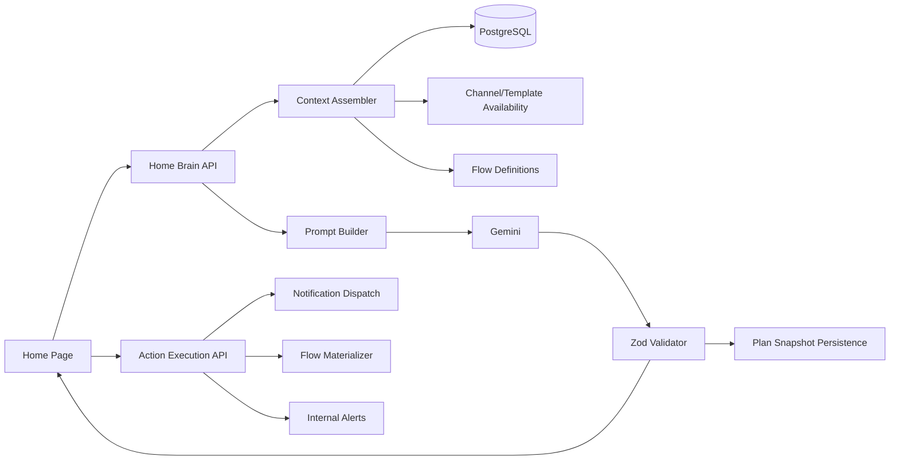

# SCRUM-12: System-Aware AI Home Brain Design Document

**Author:** AI Agent  
**Date:** March 8, 2026  
**Status:** Draft  
**Ticket:** SCRUM-12

---

## Instructions for AI Agent Implementation

This document is designed to be implementation-ready for a future AI coding agent.

### Primary Objective

Implement a **system-aware AI orchestration layer** that drives the Home experience with live data. The AI must return **structured plans** for:

- Dynamic KPIs
- Priority queues
- Recommendation cards
- Collection flow blueprints
- Bulk reminder actions
- Internal management alerts

The AI is **not** a chatbot in this feature. It acts as a **product brain** that generates UI state and executable intents.

### Required Implementation Order

1. **Backend foundation**: context assembly, prompt contract, output validation, audit persistence
2. **Home plan API**: generate structured Home plans from real system data
3. **Action execution API**: approve / modify / skip / resolve AI cards
4. **Flow materialization**: convert AI flow blueprints into existing `CollectionFlow` definitions
5. **Frontend Home UI**: replace static Home content with AI-driven sections
6. **Testing**: unit, integration, and end-to-end validation using mocked AI responses plus manual UI verification

### Existing Building Blocks To Reuse

- `server/src/services/ai.service.ts` for Gemini client initialization patterns and structured output handling
- `server/src/services/template.service.ts` for language / tone / channel template resolution
- `server/src/services/notification-dispatch.service.ts` for actual reminder delivery
- `server/src/services/flow-definition.service.ts` and `flow-runtime.service.ts` for collection-flow persistence and execution
- `client/src/pages/HomePage.tsx` as the page to replace
- `client/src/pages/DashboardsPage.tsx` and `client/src/pages/FlowsPage.tsx` as reference sources for current chart / flow UI capabilities

### Important Constraint

Do **not** build this on top of the existing bottom chat UX in `client/src/components/Chat/ChatPanel.tsx`. That component is query-oriented and chatbot-like. The Home Brain must be **page-driven**, not conversation-driven.

---

## 1. Summary

SCRUM-12 asks for a single system-aware AI prompt that works with **real system data** and dynamically generates the Home dashboard, collection flow proposals, payment reminder actions, and management alerts. The output must be **structured and system-consumable**, not prose.

In the current codebase:

- `HomePage` is static and uses hardcoded quick actions and sample stats
- `DashboardsPage` computes a fixed dashboard with fallback sample data
- `FlowsPage` already supports persisted collection-flow definitions and execution
- Messaging, templates, channel routing, and system mode already exist
- AI exists only as a query assistant, not as a structured orchestration layer

The recommended implementation is to add a new **Home Brain backend** that assembles live product context, calls Gemini with a strict JSON schema, validates the result, persists an audit snapshot, and returns a typed plan that the Home UI renders directly.

---

## 2. Goals and Non-Goals

### Goals

1. **System-aware Home plan generation** from live customers, debts, installments, notifications, channels, and system mode
2. **Dynamic dashboard composition** including KPIs, queues, cards, filters, and grouping suggestions
3. **AI-generated collection flow blueprints** that map into the existing `CollectionFlow` engine
4. **Bulk reminder and escalation actions** with explainable reasoning
5. **Automatic tone, channel, and language decisions** constrained by real availability and business rules
6. **Internal management alerts and digest cards** generated by AI
7. **User control** to approve, modify, skip, or resolve AI cards
8. **Auditability** of prompts, context summaries, AI outputs, and action outcomes

### Non-Goals

1. Replacing the existing AI query chat assistant
2. Creating a fully autonomous agent that sends messages without approval
3. Building a generic BI platform or unrestricted ad hoc visualization engine
4. Replacing the existing flow executor runtime
5. Solving every future Lovable parity requirement without a provided visual reference

---

## 3. Current State Analysis

### 3.1 Home UI Is Static

`client/src/pages/HomePage.tsx` currently renders:

- Fixed quick-action cards
- Hardcoded stats
- Static navigation buttons

There is no server-driven Home plan, no AI-generated cards, and no approval workflow.

### 3.2 Dashboards Are Semi-Real but Still Fixed

`client/src/pages/DashboardsPage.tsx` loads customer and payment data, then renders a predetermined set of tabs, stat cards, and charts. The page does not support AI-defined:

- KPI lists
- Queue definitions
- Custom groupings
- Explainable card priorities

### 3.3 Collection Flow Infrastructure Already Exists

The repository already includes:

- Prisma models for `CollectionFlow`, states, transitions, assignments, instances
- APIs in `server/src/controllers/flows.controller.ts`
- Persistence and validation in `server/src/services/flow-definition.service.ts`
- Runtime assignment and instance management in `server/src/services/flow-runtime.service.ts`
- Executor polling in `server/src/services/flow-executor.service.ts`

This is a major asset. SCRUM-12 should generate **blueprints that compile into these existing flow models**, rather than inventing a parallel flow engine.

### 3.4 Multichannel Messaging Infrastructure Already Exists

The system already supports:

- Template lookup by channel / language / tone
- Bulk send endpoints
- Notification dispatch by email / SMS / WhatsApp / voice
- Customer preference fallback
- Development mode simulation through `SystemSettings.mode`

This means Home Brain cards can execute through existing messaging services once approved.

### 3.5 AI Today Is Query-Centric, Not Product-Centric

`server/src/services/ai.service.ts` turns natural-language questions into Prisma queries and limited `updateMany` operations. It is useful for chat but does not:

- assemble product context
- output UI state
- produce cards, queues, or actions
- maintain Home-level explainability or audit snapshots

### 3.6 Gap vs SCRUM-12

| Requirement | Current State | Gap |
|-------------|---------------|-----|
| AI uses real system context | Partial AI query service only | Need full context assembly service |
| Dynamic Home dashboard | Static / fixed components | Need AI plan output and renderer |
| End-to-end collection flow generation | Flow engine exists, generation missing | Need flow blueprint materializer |
| Bulk reminder recommendations | Bulk send exists, AI planning missing | Need AI intents + approval path |
| Automatic tone/channel/language | Deterministic preference logic only | Need AI decision layer with hard constraints |
| Internal alerts / digests | Not implemented | Need in-app internal alert model and cards |
| Explainable / auditable UI decisions | Minimal | Need persisted plan snapshots and action logs |

---

## 4. Product Requirements Interpreted for Implementation

The uploaded SCRUM-12 document is strong on product intent but incomplete for implementation. The following details are added here so an AI coding agent can build safely:

1. **Structured output contract** must be explicit and validated with Zod
2. **Deterministic guardrails** must run before and after the model, so AI never chooses blocked customers or unavailable channels
3. **Audit persistence** is mandatory because the feature must stay explainable
4. **Plan execution** must reuse existing notification and flow services
5. **UI state ownership** must shift from static React definitions to server-generated plan objects
6. **Lovable parity** should be implemented as close as possible, but visual gaps should be treated as design-review follow-ups if no canonical reference assets exist in the repo

---

## 5. Proposed Architecture

### 5.1 High-Level Flow



### 5.2 New Backend Responsibilities

#### A. Context Assembler

Create a service that builds a compact, deterministic Home context from live data:

- system mode (`demo`, `development`, `production`)
- customer cohorts
- overdue and risk summaries
- recent communication outcomes
- channel availability and permission constraints
- template coverage
- existing default flow and published flows
- current Home filters / page state

This service should summarize large datasets into a **bounded prompt context** instead of dumping raw tables.

#### B. Home Brain Prompt Builder

Create a prompt builder that:

- frames the model as a system planner, not a chatbot
- passes only summarized real data
- includes hard rules and forbidden behaviors
- requests a strict JSON response conforming to the schema in Section 7

#### C. Plan Validator

Every AI response must be validated before use:

- JSON parse
- Zod schema validation
- business-rule validation
- reference validation against known channel, language, tone, template, and flow capabilities

Invalid responses should fail closed and return a handled error or a cached last-good plan.

#### D. Plan Persistence

Persist generated plans and user actions so every Home card remains auditable.

#### E. Action Execution Layer

Approving a card should dispatch through one of:

- existing bulk messaging
- existing notification dispatch
- new internal alert persistence
- flow blueprint materialization into `CollectionFlow`

---

## 6. Deterministic Rules Before AI

The AI must reason within guardrails derived from the system, not replace them.

### 6.1 Customer Eligibility Rules

Always exclude from message actions:

- `do_not_contact`
- `blocked`
- customers lacking required contact details for the chosen channel

### 6.2 Channel Availability Rules

AI may only recommend a channel if:

1. the provider is available in current system mode, or simulated in development mode
2. a template exists for the requested `templateKey + channel + language + tone`
3. the targeted cohort has usable recipient data

### 6.3 Language Resolution Rules

Resolution order:

1. explicit user modification
2. customer `preferredLanguage`
3. deterministic inference (`recommendLanguageByRegion`)
4. system default (`en` unless product team changes default)

### 6.4 Tone Resolution Rules

Resolution order:

1. explicit user modification
2. customer `preferredTone`
3. deterministic overdue-based default
4. `calm`

### 6.5 Risk Scoring for AI Context

Before prompting, compute a deterministic `riskScore` per customer or cohort using signals already available:

- open balance
- max overdue days
- count of failed deliveries
- count of unanswered notifications
- active debt count

Keep this heuristic server-side and include only the derived score and flags in the AI prompt.

---

## 7. Structured Output Contract

The Home Brain must return JSON that conforms to a strict schema.

### 7.1 Top-Level Response Shape

```typescript
interface HomeBrainPlan {
  planVersion: string;
  generatedAt: string;
  contextVersion: string;
  reasoningSummary: string;
  dashboard: DashboardDefinition;
  cards: RecommendationCard[];
  flowBlueprints: CollectionFlowBlueprint[];
  actionIntents: ActionIntent[];
  internalAlerts: InternalAlertDraft[];
}
```

### 7.2 Dashboard Definition

```typescript
interface DashboardDefinition {
  title: string;
  subtitle?: string;
  kpis: KpiDefinition[];
  queues: QueueDefinition[];
  filters: FilterDefinition[];
  groupings: GroupingSuggestion[];
}

interface KpiDefinition {
  key: string;
  label: string;
  value: number | string;
  format: 'currency' | 'number' | 'percent' | 'text';
  trend?: {
    direction: 'up' | 'down' | 'flat';
    value?: number;
    label?: string;
  };
}

interface QueueDefinition {
  queueId: string;
  title: string;
  description?: string;
  count: number;
  customerIds: string[];
  priority: 'critical' | 'high' | 'medium' | 'low';
}

interface FilterDefinition {
  key: string;
  label: string;
  type: 'select' | 'multi_select' | 'date_range' | 'toggle';
  options?: Array<{ label: string; value: string }>;
}

interface GroupingSuggestion {
  key: string;
  label: string;
  supportedValues: string[];
}
```

### 7.3 Recommendation Cards

```typescript
interface RecommendationCard {
  cardId: string;
  type: 'queue' | 'bulk_action' | 'flow' | 'alert' | 'kpi_explainer';
  title: string;
  body: string;
  priority: 'critical' | 'high' | 'medium' | 'low';
  badges: string[];
  targetCustomerIds: string[];
  queueRef?: string;
  actionIntentIds: string[];
  explainability: {
    whyNow: string;
    keySignals: string[];
  };
}
```

### 7.4 Action Intents

```typescript
interface ActionIntent {
  id: string;
  type:
    | 'open_queue'
    | 'send_bulk_reminders'
    | 'switch_channel_for_cohort'
    | 'materialize_collection_flow'
    | 'assign_flow_to_customers'
    | 'notify_management'
    | 'create_internal_alert';
  title: string;
  requiresApproval: boolean;
  payload: Record<string, unknown>;
}
```

### 7.5 Internal Alert Draft

```typescript
interface InternalAlertDraft {
  id: string;
  severity: 'critical' | 'high' | 'medium' | 'low';
  audience: 'management' | 'operations' | 'collections';
  title: string;
  body: string;
  metadata?: Record<string, unknown>;
}
```

### 7.6 Collection Flow Blueprint

```typescript
interface CollectionFlowBlueprint {
  blueprintId: string;
  name: string;
  description?: string;
  audienceCustomerIds: string[];
  steps: Array<{
    stepKey: string;
    dayOffset: number;
    actionType: 'assigned_channel' | 'send_email' | 'send_sms' | 'send_whatsapp' | 'voice_call';
    explicitChannel?: 'email' | 'sms' | 'whatsapp' | 'call_task';
    languageMode: 'preferred' | 'explicit' | 'inferred';
    language?: 'en' | 'he' | 'ar';
    toneMode: 'auto' | 'explicit';
    tone?: 'calm' | 'medium' | 'heavy';
    templateKey: string;
    expectedOutcome?: string;
    fallbackRule?: string;
  }>;
}
```

### 7.7 Output Rules

The model must never:

- return freeform markdown
- invent customers that are not in the context
- reference unavailable channels
- include actions for blocked / opt-out customers
- emit unbounded customer lists

The server should cap:

- max KPIs: 8
- max queues: 6
- max cards: 12
- max customers per card payload: 200 direct IDs, otherwise a cohort filter spec

### 7.8 Example Output

```json
{
  "planVersion": "home-brain-v1",
  "generatedAt": "2026-03-08T12:00:00.000Z",
  "contextVersion": "ctx_20260308_120000",
  "reasoningSummary": "Priority is concentrated in overdue Hebrew-speaking customers with repeated WhatsApp non-response.",
  "dashboard": {
    "title": "Today's Collection Focus",
    "kpis": [
      { "key": "total_overdue_balance", "label": "Total overdue", "value": 2485000, "format": "currency" }
    ],
    "queues": [
      {
        "queueId": "high_risk_hebrew_nonresponsive",
        "title": "High-risk Hebrew speakers with no WhatsApp response",
        "count": 34,
        "customerIds": ["uuid1", "uuid2"]
      }
    ],
    "filters": [],
    "groupings": []
  },
  "cards": [
    {
      "cardId": "card_1",
      "type": "bulk_action",
      "title": "Switch 34 non-responsive customers from WhatsApp to SMS",
      "body": "Customers in this cohort have open balances and failed to engage on WhatsApp.",
      "priority": "high",
      "badges": ["34 customers", "Hebrew", "Overdue >14d"],
      "targetCustomerIds": ["uuid1", "uuid2"],
      "actionIntentIds": ["intent_1"],
      "explainability": {
        "whyNow": "Repeated WhatsApp non-response increases collection delay.",
        "keySignals": ["overdue>14", "whatsapp_failed", "phone_available"]
      }
    }
  ],
  "flowBlueprints": [],
  "actionIntents": [
    {
      "id": "intent_1",
      "type": "send_bulk_reminders",
      "title": "Send SMS reminders to cohort",
      "requiresApproval": true,
      "payload": {
        "customerIds": ["uuid1", "uuid2"],
        "overrideChannel": "sms",
        "overrideLanguage": "he",
        "overrideTone": "medium",
        "templateKey": "debt_reminder"
      }
    }
  ],
  "internalAlerts": []
}
```

---

## 8. Data Model

### 8.1 New Enum: `AiPlanStatus`

```prisma
enum AiPlanStatus {
  generated
  approved
  modified
  skipped
  resolved
  failed
  expired
}
```

### 8.2 New Model: `AiPlanSnapshot`

Stores the generated Home plan plus a sanitized context summary.

```prisma
model AiPlanSnapshot {
  id              String       @id @default(uuid()) @db.Uuid
  surface         String       // e.g. "home"
  promptVersion   String       @map("prompt_version")
  contextVersion  String       @map("context_version")
  locale          String
  filtersJson     Json?        @map("filters_json")
  contextSummary  Json         @map("context_summary")
  outputJson      Json         @map("output_json")
  reasoningSummary String?     @map("reasoning_summary")
  status          AiPlanStatus @default(generated)
  generatedBy     String       @map("generated_by")
  createdAt       DateTime     @default(now()) @map("created_at") @db.Timestamptz
  updatedAt       DateTime     @updatedAt @map("updated_at") @db.Timestamptz

  actions AiPlanAction[]

  @@index([surface, createdAt])
  @@index([status])
  @@map("ai_plan_snapshots")
}
```

### 8.3 New Model: `AiPlanAction`

Stores the outcome of approving, modifying, skipping, or resolving a card / intent.

```prisma
model AiPlanAction {
  id              String       @id @default(uuid()) @db.Uuid
  planId          String       @map("plan_id") @db.Uuid
  cardId          String       @map("card_id")
  intentId        String?      @map("intent_id")
  actionType      String       @map("action_type")
  status          AiPlanStatus @default(generated)
  modifiedPayload Json?        @map("modified_payload")
  executionResult Json?        @map("execution_result")
  performedBy     String       @map("performed_by")
  createdAt       DateTime     @default(now()) @map("created_at") @db.Timestamptz

  plan AiPlanSnapshot @relation(fields: [planId], references: [id], onDelete: Cascade)

  @@index([planId])
  @@index([cardId])
  @@map("ai_plan_actions")
}
```

### 8.4 New Model: `InternalAlert`

Required for management notifications that should outlive a transient Home card.

```prisma
model InternalAlert {
  id          String   @id @default(uuid()) @db.Uuid
  severity    String
  title       String
  body        String   @db.Text
  audience    String   // e.g. "management", "operations"
  metadata    Json?
  status      String   @default("open")
  createdBy   String   @map("created_by")
  createdAt   DateTime @default(now()) @map("created_at") @db.Timestamptz
  updatedAt   DateTime @updatedAt @map("updated_at") @db.Timestamptz

  @@index([audience, status])
  @@map("internal_alerts")
}
```

### 8.5 Migration Notes

These additions are additive and do not change existing flow or messaging tables.

---

## 9. Backend API Design

### 9.1 `POST /api/home-brain/plan`

Generate a Home plan from live system context.

**Request**

```json
{
  "locale": "en",
  "filters": {
    "segment": "high_risk",
    "language": "he"
  },
  "forceRefresh": false,
  "maxCards": 8
}
```

**Response**

```json
{
  "success": true,
  "data": {
    "planId": "uuid",
    "status": "generated",
    "plan": {}
  }
}
```

### 9.2 `GET /api/home-brain/plans/:id`

Fetch a persisted plan snapshot for refresh / audit / revisit flows.

### 9.3 `POST /api/home-brain/cards/:cardId/approve`

Approve and execute the primary action for a card.

**Request**

```json
{
  "planId": "uuid",
  "performedBy": "ui",
  "modifications": {
    "overrideChannel": "sms",
    "overrideTone": "medium"
  }
}
```

**Execution behavior**

| Card / intent type | Execution path |
|--------------------|----------------|
| `send_bulk_reminders` | Existing messaging bulk-send path |
| `switch_channel_for_cohort` | Existing messaging bulk-send with override channel |
| `materialize_collection_flow` | New flow materializer + existing `flow-definition.service.ts` |
| `assign_flow_to_customers` | Existing `flow-runtime.service.ts` |
| `notify_management` | New `InternalAlert` persistence |
| `create_internal_alert` | New `InternalAlert` persistence |

### 9.4 `POST /api/home-brain/cards/:cardId/skip`

Persist skip outcome with optional reason.

### 9.5 `POST /api/home-brain/cards/:cardId/resolve`

Mark the card resolved without executing a side effect.

### 9.6 `POST /api/home-brain/cards/:cardId/modify`

Persist user changes to the generated payload and optionally preview the updated execution result.

### 9.7 Controller / Route Layout

```
server/src/controllers/home-brain.controller.ts   # NEW
server/src/routes/home-brain.routes.ts            # NEW
server/src/routes/index.ts                        # UPDATED
server/src/services/home-brain/                   # NEW DIRECTORY
```

---

## 10. Flow Blueprint Materialization

The AI should not write directly into `CollectionFlow` tables. Instead, the server converts a validated blueprint into a draft flow definition.

### 10.1 Translation Rules

For each blueprint step:

- create one `CollectionFlowState`
- set `actionType` based on blueprint `actionType`
- set `explicitChannel` when provided
- set `tone` when explicit
- create a transition from previous step using `waitSeconds = delta(dayOffset) * 86400`

### 10.2 Start / End Rules

- First step becomes `isStart = true`
- Final step becomes `isEnd = true`
- Add a terminal state if the blueprint omits an explicit end

### 10.3 Materialized Flow Metadata

Draft flow records should use:

- `flowKey`: `ai_generated_<timestamp>`
- `createdBy`: `home_brain`
- `description`: include originating `planId` and `cardId`

### 10.4 Assignment Strategy

On approval:

1. materialize draft flow
2. optionally publish immediately only if product confirms that AI-generated flows may execute without manual builder review
3. assign targeted customers through `flow-runtime.service.ts`

**Recommended default:** materialize as draft first, then require explicit publish if the organization wants higher control.

---

## 11. Home UI Design

### 11.1 Replace Static `HomePage`

`client/src/pages/HomePage.tsx` should become a data-driven screen that:

- loads a Home plan on mount
- supports refresh and filter changes
- renders AI-defined KPIs, queues, and cards
- exposes approve / modify / skip / resolve interactions
- shows short explainability copy for every card

### 11.2 Required Sections

1. **Header / context banner**
   - current mode
   - refresh time
   - selected filters

2. **KPI rail**
   - AI-defined KPI cards

3. **Priority queues**
   - list of cohorts with count, reason, CTA

4. **Recommendation cards**
   - primary actions
   - reason summary
   - approval controls

5. **Alerts / management digest**
   - internal notifications generated by AI

6. **Card details drawer**
   - show explainability
   - preview affected customers
   - allow modifications before approval

### 11.3 UX Behavior

For every recommendation card, the user can:

- **Approve**: execute or materialize the action
- **Modify**: change channel / tone / language / target size / timing
- **Skip**: dismiss but keep audit trail
- **Mark resolved**: keep the card in history as completed

### 11.4 Lovable Parity Note

The SCRUM-12 requirement says the Home UI should match Lovable behavior. This repo does not include a canonical Lovable implementation for Home. The implementation agent should therefore:

1. reproduce the intended interaction model from the ticket
2. keep the layout modular for later visual polish
3. flag any remaining parity gaps as design-review issues rather than inventing hidden behavior

---

## 12. Context Assembly Design

### 12.1 Context Inputs

Build a compact context object with:

- system mode
- total active customers
- overdue balance totals
- high-risk cohort counts
- recent deliveries by channel and outcome
- channel provider availability
- template coverage by channel / language / tone
- top candidate cohorts
- top candidate customers for urgent cards
- currently published default flow
- current Home filter state

### 12.2 Suggested Context DTO

```typescript
interface HomeBrainContext {
  generatedAt: string;
  mode: 'demo' | 'development' | 'production';
  filters: Record<string, unknown>;
  metrics: {
    totalCustomers: number;
    totalOverdueBalance: number;
    collectedToday: number;
    overdueCustomers: number;
  };
  channelAvailability: Record<string, boolean>;
  templateCoverage: Array<{
    channel: string;
    language: string;
    tone: string;
    available: boolean;
  }>;
  cohorts: Array<{
    cohortId: string;
    label: string;
    count: number;
    totalBalance: number;
    avgOverdueDays: number;
    languages: string[];
    recommendedChannelOptions: string[];
    riskLevel: 'critical' | 'high' | 'medium' | 'low';
    sampleCustomerIds: string[];
  }>;
  customers: Array<{
    id: string;
    fullName: string;
    balance: number;
    overdueDays: number;
    preferredLanguage?: string | null;
    preferredChannel?: string | null;
    preferredTone?: string | null;
    eligibleChannels: string[];
    recentCommSummary: string[];
    riskScore: number;
  }>;
}
```

### 12.3 Prompt Size Strategy

To keep tokens bounded:

- send full detail for at most 100 customers
- send aggregated cohort summaries for larger groups
- include only recent communications from the last 30 days
- include only active / relevant templates and provider availability

---

## 13. Security, Safety, and Explainability

### 13.1 Safety Rules

- No autonomous send without user approval
- No messaging blocked or opt-out customers
- No unsupported channel recommendations
- No hidden execution; every action must create an audit row

### 13.2 Explainability Requirements

Every card must expose:

- `whyNow`
- key signals used
- targeted customer count
- previewable payload before approval

### 13.3 Prompt / Output Logging

Do not persist raw full prompt text if it risks storing excessive PII. Persist:

- prompt version
- compact context summary
- validated AI output
- user action outcome

---

## 14. File Reference Summary

### Files to Create

| File | Purpose |
|------|---------|
| `server/src/controllers/home-brain.controller.ts` | Home Brain generate / approve / skip / modify / resolve endpoints |
| `server/src/routes/home-brain.routes.ts` | Route registration |
| `server/src/services/home-brain/context-assembler.service.ts` | Build live summarized system context |
| `server/src/services/home-brain/home-brain.service.ts` | Prompting, validation, persistence orchestration |
| `server/src/services/home-brain/plan-validator.ts` | Zod schema + business validation |
| `server/src/services/home-brain/flow-materializer.service.ts` | Convert AI blueprint to `CollectionFlow` draft |
| `client/src/types/home-brain.ts` | Shared client-side types |
| `client/src/components/home/AiKpiRail.tsx` | KPI renderer |
| `client/src/components/home/PriorityQueues.tsx` | Queue renderer |
| `client/src/components/home/RecommendationCard.tsx` | AI card UI |
| `client/src/components/home/CardDetailDrawer.tsx` | Modify / approve UX |

### Files to Modify

| File | Changes |
|------|---------|
| `server/prisma/schema.prisma` | Add `AiPlanSnapshot`, `AiPlanAction`, `InternalAlert`, `AiPlanStatus` |
| `server/src/routes/index.ts` | Register Home Brain routes |
| `server/src/services/ai.service.ts` | Reuse model init patterns or extract shared model client if helpful |
| `server/src/controllers/messaging.controller.ts` | Reuse bulk-send execution path where useful |
| `server/src/services/notification-dispatch.service.ts` | Possibly expose preview helpers / shared validation |
| `client/src/pages/HomePage.tsx` | Replace static content with plan-driven Home screen |
| `client/src/services/api.ts` | Add Home Brain API client methods |

---

## 15. Implementation Phases

### Phase 1: Backend Foundation

- Add Prisma models and migration
- Build context assembler
- Build prompt builder and validator
- Add `POST /api/home-brain/plan`

### Phase 2: Home Rendering

- Replace static Home page
- Render KPI rail, queues, and recommendation cards
- Add refresh and filter handling

### Phase 3: Action Execution

- Implement approve / modify / skip / resolve endpoints
- Connect bulk reminder execution
- Connect internal alert creation

### Phase 4: Flow Materialization

- Convert AI flow blueprints into draft `CollectionFlow` definitions
- Add optional publish / assign path

### Phase 5: Polish and Safety

- Improve explainability UI
- Add caching / last-good plan fallback
- Finalize error states and skeleton loading

---

## 16. Testing Strategy

### 16.1 Unit Tests

| Component | Test Cases |
|-----------|------------|
| `context-assembler.service.ts` | correct cohort summaries, risk flags, channel eligibility |
| `plan-validator.ts` | rejects invalid JSON, invalid card references, unavailable channels |
| `flow-materializer.service.ts` | step-to-state translation, wait-seconds calculation, start/end correctness |
| deterministic rule helpers | blocked / opt-out exclusion, template availability checks |

### 16.2 Integration Tests

| Endpoint | Test Cases |
|----------|------------|
| `POST /api/home-brain/plan` | returns validated plan using mocked AI output |
| `POST /api/home-brain/cards/:cardId/approve` | executes correct backend path |
| `POST /api/home-brain/cards/:cardId/modify` | persists modified payload |
| `POST /api/home-brain/cards/:cardId/skip` | updates audit status |
| `POST /api/home-brain/cards/:cardId/resolve` | updates audit status |

### 16.3 End-to-End Tests

1. Load Home page with live seeded data and verify AI-generated KPIs / queues / cards render
2. Approve a bulk reminder card and verify notifications / deliveries are created
3. Approve a flow blueprint and verify a draft `CollectionFlow` is created
4. Create a management alert card and verify `InternalAlert` persistence
5. Modify a recommendation before approval and verify execution uses modified values

### 16.4 Manual QA Checklist

- [ ] Home page loads from `POST /api/home-brain/plan`, not hardcoded arrays
- [ ] Cards show explainability text
- [ ] Approve / Modify / Skip / Resolve work and remain auditable
- [ ] AI never targets blocked or opt-out customers
- [ ] AI never recommends unavailable channels
- [ ] Generated flow blueprints materialize into valid draft flows
- [ ] Refresh regenerates or reloads the latest valid plan
- [ ] Empty-state behavior is clear when no urgent actions exist

### 16.5 AI Testing Recommendation

For automated tests, mock the Gemini response. Do not call the live model in CI.

---

## 17. Rollout Plan

### Phase A: Safe Read-Only Home

Ship plan generation and rendering first with no side-effect approvals enabled.

### Phase B: Controlled Action Execution

Enable bulk reminder approvals and internal alerts.

### Phase C: Flow Materialization

Enable AI-generated flow drafts and optional assignment.

### Phase D: Full Home Brain

Enable all card types after validation with real operators.

---

## 18. Open Questions

1. **Lovable reference:** Is there a definitive Home reference file, screenshot pack, or Figma for exact parity?
2. **Approval semantics:** Should approving a generated flow immediately publish and assign it, or only create a draft?
3. **Management notifications:** Where should management alerts surface beyond Home cards: in-app only, email, Slack, or all three?
4. **Default language:** SCRUM-10 defaults to Hebrew in places, while newer messaging logic often falls back to English. Which default should Home Brain use globally?
5. **Card persistence window:** How long should generated cards stay active before expiring?
6. **Cohort size limits:** What is the safe maximum customer count for a single bulk recommendation?
7. **Prompt versioning:** Should prompt versions be database-backed or code constants?

---

## 19. Final Recommendation

Implement SCRUM-12 as a **new AI orchestration layer on top of the existing messaging and flow infrastructure**, not as a separate chatbot or a parallel workflow engine. The core design principle is:

**AI decides what the product should show and recommend; deterministic services decide what is allowed and how execution happens.**

That split will keep the feature explainable, auditable, and implementable with the codebase that already exists.

---

*End of Design Document*
